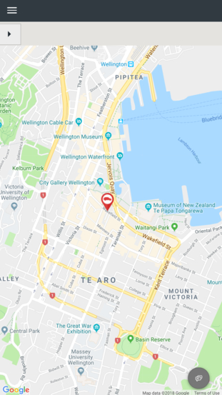
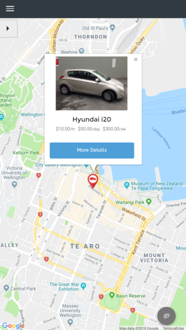
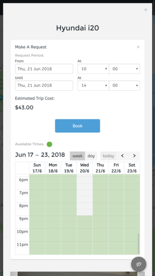
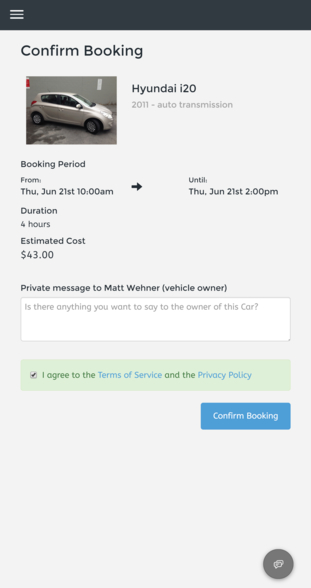
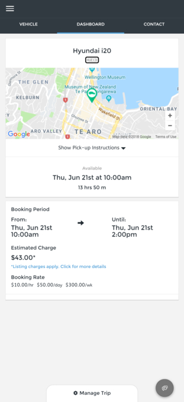
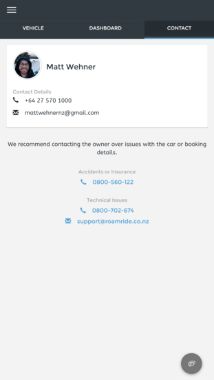
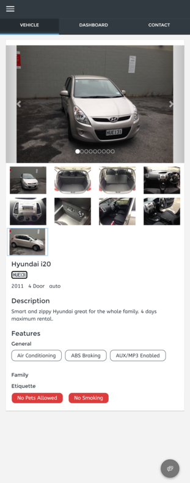

# The Hourfleet App

Every Hourfleet customer gets their own hosted and tailored *responsive* <u>Web App</u>, that is to be used by both you the operator to manage your Car Share, and your users to manage their account, book and use cars in your Car Share.

> Note: A **responsive** web app is an application running in a web browser (like google chrome) that changes the way it presents information based upon which device the browser is being used on now. Either desktop, or mobile device.

The Hourfleet App is not available (as of Sept 2019) as a separate downloadable app from an app store like (Apple iTunes or Google Play).

However, the Hourfleet App is one of the latest line of web apps called Progressive Web Apps (PWA's) that looks and works very similar to a store app. Furthermore, a PWA can be installed onto a device as if it was downloaded from an app store.

## Progressive Web App Support

Support across the internet for PWA's has increased in recent years. Some browser and device vendors have been very pro-active in making this technology available, such as Google and Samsung. However, some vendors like Apple, are still a little behind (as of Sept 2019).

To offer an installation experience to end users (in the website), bowsers have needed to support a feature of PWA called the `beforeinstallpromptevent` feature, which detects that the website has the necessary assets (images, metadata etc.) and is in a state to be installed. If so, a user can install the app to their home screen of their device, just like any other app on their device.

The feature to install the app on a device is available in many of the menus of the website. The presence of such a menu is dependent on the configuration of the Car Share. 

> Note: When configuring your Car Share be sure to complete the sections on SEO and branding to give your users the best experience for installing the App to their device. The experience will be downgraded if you don't provide all the suggested images.

The install experience may be different on different browsers on different devices. This is currently the support from browser and device vendors.

# The App

Whether you install the Hourfleet App to your device, or use it in a web browser the experience is identical.

The Hourfleet App is intended to be used by both yourself (as an operator) and by your customers to manage their account, find cars, book them and use those cars.

Hourfleet is a full-featured car sharing platform. In practice this means there are a large number of screens and features, and all features are available on all/any device type - from desktop, to tablet and phone. This section captures some of the key screens that will exist* in your Car Share. 

We have used mobile form-factor screens, and where the screen would scrolls we've stretched the image. Feel free to check back, as we will extend this set of images over time.

Table of Contents  
- [Finding and booking a car](#finding-and-booking-a-car)
- [Managing a booking](#managing-a-booking)
- [Insurer dashboard](#insurer-dashboard)

### Finding and booking a car 

Cars can be located by entering a location and/or date and time of pickup. Car can also be found by browsing the map and clicking on the  pins. Cars that are available have red pins, while those that are unavailable are shown with grey pins. A borrower can view the car's full details, and make a request. They are required to accept the Terms of Service and Privacy Policy each time they make a booking.

|  

|  

### Managing a booking

All bookings are managed from a single dashboard. Once a booking immediately prior to its start time, the interface provides a `start` button for the borrower to initiate their booking

|  

|  

> Note: Hourfleet is under constant revision, and sometimes we're a bit behind updating these images with the latest versions. 