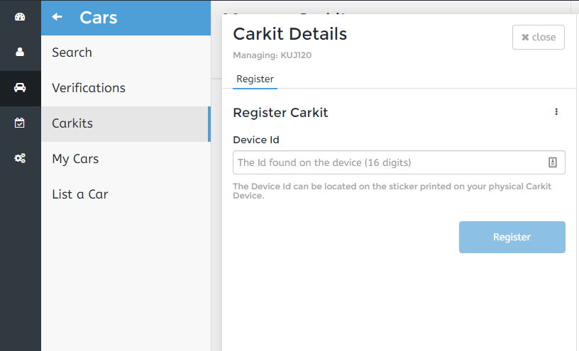
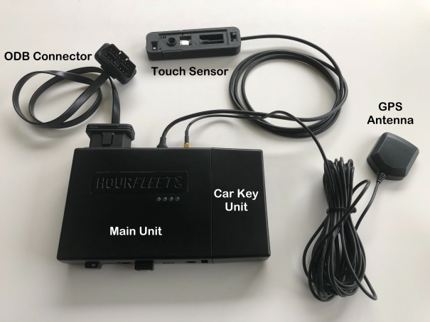

## Verifying Your Cellular Connectivity  

The first test we need to conduct is designed to ensure that your SIM provides cellular data connectivity. To do this you'll need the following:
- The red/white cellular modem  
- Your regular sized SIM
- A laptop/PC running Windows 10 ..OR.. a Mac runnning MacOS 10.12 or higher

We are going to connect your computer to the internet using the cellular modem. The steps are:
1. We are going to insert your standard sized SIM into the cellular modem as shown below. But first, the orientation is important. The little diagonal corner will be on the left, as shown, and the gold/metal contacts are facing down into the modem. It can be difficult removing the SIM if you put it in incorrectly, so double check before you insert it.  

  

2. Disconnect your computer from the internet, removing any Ethernet LAN cable and switching WiFi off.  
3. Connect the cellular modem to a USB port. This should be a 'native' USB port on your computer, not a USB hub,  
4. The cellular modem LED will start flashing green, may then start flashing blue or purple.  
5. After 60 seconds we expect the cellular modem LED to show steady blue or purple. If it does then use a browser to go to https://hourfleet.com. If you can browse this site then your cellular modem is correctly connecting to the internet.
6. Remove the cellular modem, and reconnect and LAN and/or Wifi so that your computer is back to its original state.  

## Verifying Car Kit Before Installation  

It's a good idea to verify that the car kit has internet connectivity BEFORE installing it in your car. We have designed the car kit so that it can be powered on your desk using a regular 12v mains (100-230v) adapter, and this allows you to confirm that the [cellular modem connects to the internet using your SIM](http://docs.hourfleet.com/carkit.html#cellular-connectivity). Follow these steps.
1. If not already done, insert your standard sized SIM into the cellular modem as shown above
2. Connect the modem to the 10cm black cable which is already attached to the main unit
2. Connect the Tap sensor
2. Connect the 'barrel' power supply to your mains power. The result will be
   - The main unit will show a steady red LED, and a steady green LED
   - The Tap sensor will show a flashing red LED  
   - After a few seconds, the cellular modem will show flashing green LED
   
We are now at an important point. We need to confirm that the cellular modem connects to the internet. This can take several minutes, with connection being indicated by a steady blue, or steady purple LED. We must have an internet connection before proceeding with any of the following steps.  

At this point the car kit is booting up and will will shortly request a set of encrypted QR keys from the Hourfleet server. When these keys arrive the Tap unit LED will begin flashing purple, and once all QR keys have been received the Tap unit will begin a slow blue flash sequence.

Once you see the Tap unit flashing slow blue, wait 15 minutes for the device to 'sleep'. You can tell the car kit is asleep when
1. The cellular modem LED is off
1. The only LED showing on the car kit is an infrequent, short flash of the red LED

With the unit asleep you can disconnect the 12v power supply. 

Important: We ship your device with the Hourfleet server configured to send dummy QR keys to your car kit. With the steps above confirming these dummy keys are being deliver, the next step to for you to contact us and ask to enable live QR keys.

## Registering the Carkit on Your Car Share

At this point you will have confirmed the following:
1. That your SIM card and cellular operator account provides cellular data access for the car kit
1. That Hourfleet has sucessfully delivered dummy QR keys to the Tap sensor
1. That the Hourfleet server is ready to send live QR keys to the Tap sensor

The next step is to register your car kit. This creates an association between one specific car kit, and the matching car which you have  already  set up in Hourfleet.  Let's gather the information you need.
- Make a note of  the **license plate** of the car
- Make a note of the number on the **sticky label under the main carkit unit**. Ignore the sticky label on the key unit. This number will be 8 digits long.

You will need both of these to complete the electronic registration in the Hourfleet App next.

Open the Hourfleet App at your Car Share URL ( `https://yourcompany.hourfleet.com`), login and go to the 'Operations' dashboard.

- From the menu of the far left, click  'Cars', and then 'Carkits'
- Enter the license plate number of the car, and hit 'Search'
- When the car is found, enter the Device Id, which is the 8 digit number you noted from the sticky label on the main carkit unit. 
- Click 'Register' 

## Installing the Carkit  

The Hourfleet carkit is simple to install, and some customers may choose to do this themselves. Even so, we strongly recommend that this  work is undertaken by a professional. They will be able to advise you on the best practice for your car, and ensure the installation is safe, secure and asthetically pleasing. Installation should take less than 15 minutes per car.

Familiarize yourself with the following parts:

1. The carkit Main Unit and the Car Key Unit
2. The GPS Antenna
3. The Touch Sensor
4. The OBD Connector  
5. The red/white cellular modem (not shown)  

The recommended installation process is as follows. 

1. Identify where you wish to locate the main unit. We recommend installing the car kit under the dashboard (or above the footwell) on the drivers side of the car. All cars are different in how they are configured here, so you'll need to consider the physical space and proximity to the three primary peripherals.

2. Leave the adhesive pads covered and test locate the Touch Sensor on the windscreen as low and as close the drivers side of the windscreen, so it does not obstruct the drivers view of the road. Ideally, place it at the same height as an average persons elbow. This makes it very accessible to operate for Tap Tap Go outside the car for most people. Only remove the adhesive covers and fix the Touch sensor when you are sure of the placement. Run the cable down behind the dashboard to into the area that you'll be afixing the main device. This is the bit that is most likely to require professional support.  
**Important**: Take care locating and confirming the placement. Once you remove the adhesive covers and place the Tap Tap Go device on the windscreen is difficult to remove.

2. The GPS antenna should be placed on the dashboard towards the windscreen. The cable is sufficiently long to allow it to be placed in either side of the car. What is important is that the antenna unit has a 'clear view' of the sky. For this reason we recommend keeping it 5+ centimeters in from the A pillar. The antenna is supplied with an adhesive mounted metal disk. The antenna inself is magnetic, and it is placed on the metal disk once it is adhered to the dashboard. Run the cable down behind the dashboard to into the area that you'll be afixing the main device. This is the bit that is most likely to require professional support.  

3. Locate the OBD connector. This is usually near the steering column, and it may be accessed from underneath the footwell, or from a removable panel. This is the source of car telematics data, and also of power for the car kit. Connect the OBD 'flat noodle' cable to the OBD connector and run it into the area that you'll be afixing the main device.  

4. At this point you should have three cables available in the area that you'll be afixing the main device. Connect the Tap Tap Go to the main device. It should be a snug fit through the case, but force should not be used lets you accidentlly damage the main device.  

5. Connect the GPS antenna to the main device. Twist until finger tight. You should very gently tighten with a 8mm or 3/8th" spanner.  

6. The last thing to connect is the ODB cable. When you do this the device will power up initially showing red and greed LEDs. Once powered up, as indicated by red and green LEDs, we recommend that you do not remove the OBD cable for any reason. If you do wish to remove the device waiting 20 minutes should have the main device showing no green LED, and a slow flashing red LED. When the device is in this state it is ok to disconnect it from its OBD power source.  

7. With the device connect and powered it's time to secure it in the position that you selected earlier. The following are important considerations:  
- The device should be secured firmly in place  
- The cellular modem should also be secured. This can be achieved by using professional tape to afix it to the main device  
- Any spare cable should be secured away from the footwell  

**Important**: It is critical that the safe operation of the car by drivers is in no way impeded by the placement of the main device, or by any of the cables. Your chosen installer will be able to advise you on the best practice for your car, and ensure the installation is safe, secure and asthetically pleasing.  

## Tap Tap Go LEDs

Each Tap Tap Go has a single LED used to indicate its state.  

- **No LED**: Tap Tap is disabled. Either the device is not correctly powered, or the car has detected vibrations over the last 5 seconds, such as vibrations from driving down the road. 
- **Red flashing (slow)**: Power is applied. The car kit is not yet configured, and is waiting to connect to Hourfleet over the internet, for which it needs cellular coverage.
- **Blue flashing** : Ready for normal lock/unlock operation.
- **Purple flashing** : The car kit is being configured by the Hourfleet.
- **Green pulsing**: Ready for presentation of a unlock/lock key, in response to a Tap Tap on the window screen.
- **Green flashing**: A valid QR key has been presented. The car doors will unlock or lock as appropriate.
- **Red flashing (fast)**: An invalid QR key has been presented.  
