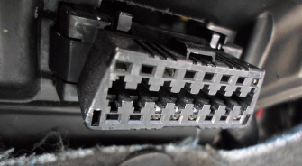

# Installing the Carkit
The Hourfleet carkit is simple to install in a car by any person.

Normally, for most car share services, it will be the owner/operator of the car that will be responsible for arranging, overseeing or performing the installation of the carkit. The operator of the car share will register the carkit electronically with the Car Share.

> Note: Some car share operators may choose to outsource the physical installation of the carkit in their cars to other parties, but the electronic registration of the carkit can only be done by the operator in the Hourfleet App.

Familiarize yourself with the following parts:

1. The carkit Main Unit and the Car Key Unit
2. The GPS Antenna
3. The Touch Sensor
4. The OBD Connector

Ideally, you would want to mount the Main Unit (connected to Car Key Unit) under the dashboard on the drivers side of the car, or as close to the drivers side as possible.

This is so that the Touch Sensor can be mounted in teh windscreen close to the drivers side door. Since this is where drivers will want to open the doors from. It can also be mounted on the passenger side for cars that are always parked on busy streets.

### OBD Connector

Plug the ODB Connector into the Onboard Diagnostics (OBD) connector of the car, which should also under the dashboard. 

This connector can be located in different places in different cars, usually at least one connection under the dashboard.

### GPS Antenna

Then, you route the GPS Antenna cable from the Main Unit up onto sit on the dashboard. It can be on either the drivers side of the car or the passengers side. Ideally, you would route the GPS Antenna cable out of sight behind the dash. Place the GPS Antenna in plain sight of the windscreen, either on the dashboard, or adhered to the windscreen near the top of the windscreen, with a clear view of the sky, and not obscured by any stickers on the windscreen.

### Touch Sensor  

Then you route the Touch Sensor cable from the main unit up onto the dashboard and up the side of the windscreen. Like the GPS cable, try to route the Touch Sensor cable out of sight behind the dash. Run the Touch Sensor cable up along the vertical support column that supports the side of the windscreen on either the drivers or passengers side. This is the vertical column between the glass of the windscreen and the glass of the side door window. Adhere the Touch Sensor to the windscreen as low and as close the drivers side of the windscreen, so it does not obstruct the drivers view of the road. Ideally, place it at the same height as an average persons elbow. This makes it very accessible to operate for Tap Tap Go outside the car for most people.

### Make a Note

Finally, make a note of both the **license plate** of the car, and the **number from the sticky label under the main carkit unit**. You will both of these to complete the electronic registration in the Hourfleet App next.

## Registering the Carkit on Your Car Share

As an operator of your car share, you will need to register the carkit as being installed into one of the cars already registered in your network of cars on your car share. 

This must be done before anyone in the car share can access or use the car from the Hourfleet App, and before you can verify the installation of the physical carkit.

>  Note: This step is also necessary any time a main carkit unit is swapped between cars, or a carkit is removed from a car. In those cases, the carkit will need to be unregistered from the first car, and if necessary re-registered with another car.

Once the carkit is physically installed then open the Hourfleet App at your Car Share URL ( `https://yourcompany.hourfleet.com`), login and go to the 'Operations' dashboard.

- From the menu of the far left, click  'Cars', and then 'Carkits'
- Enter the license plate number of the car, and hit 'Search'
- When the car is found, enter the Device Id, from the value you wrote down from the sticky label on the main carkit unit.
- Click 'Register' 

## Verify the Physical Installation

Now that the carkit has been physically installed and electronically registered. Check that the OBD connector has been connected successfully, you should see a slow flashing red light on the Touch Sensor in the window screen (from the outside of the car). This confirms that the device is working correctly.

> If the red light is not flashing, then check your OBD connector

For the next part, you will need the other spare (proximity) car key for the car.

You will need to start the car, as you do normally with the start button.

For the next part, the car has to be in a location where it has cellular access to the internet.

You may need to move the car to do this, or drive around for a few minutes in a cell covered area.

Either way, after a few minutes, you will notice that the red flashing light on the Touch Sensor will change from flashing red to flashing blue. It may, flash purple for a few seconds turning from red to blue. This may take anywhere between 2 and 15 mins.

Once the Touch Sensor turns to flashing blue. You may stop the car. 

The carkit is now fully programmed and can now be used by your customers (through the Hourfleet app) key-lessly without any physical keys. All they need is a smartphone with internet access!

### Troubleshooting Physical Installation

From the moment the carkit is first powered to the moment it is fully configured and ready for lock/unlock operation, will be about 2-15 mins. 

The LED light in the windscreen indicates the car kit's current state:  

- **No light**: Tap, Tap is disabled. Either the device is not correctly powered, or the car has detected vibrations over the last 5 secs, such as vibrations from driving down the road.
- **Red flashing (slow)**: Power is applied. The car kit is not yet configured, and is waiting to connect to Hourfleet over the internet, for which it needs cellular coverage.
- **Purple flashing** : The car kit is configured by the Hourfleet.
- **Green pulsing**: Ready for presentation of a unlock/lock key, in response to a Tap, Tap on the window screen.
- **Blue flashing** : Ready for normal lock/unlock operation.
- **Green flashing**: A valid QR key has been presented. The car doors will unlock or lock as appropriate.

