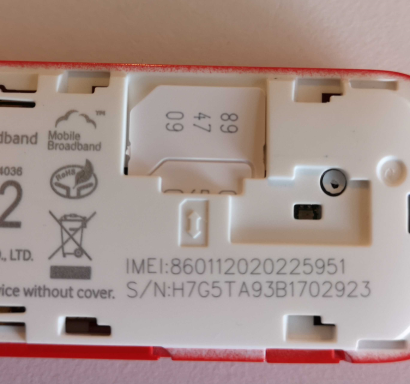

# [What They Do](#what-they-do)

No need for car keys anymore! Carkits are the devices fitted into the cars in your car sharing network, that remove the need for you or your customers to worry about physical car keys.

As there are no keys to exchange with another human or office manager or kiosk, cars fitted with carkits open up economic scenarios like: many rentals in a single day, renting cars by the minute, and A to A drop offs. These scenarios are not economically viable when physical keys have to be organisaed and returned.

Carkits also track the location of the car and other metrics, such as: distance travelled, fuel consumed and driving styles. This kind of data makes cheaper insurance products for car sharing business.

# [Carkit Compatibility](#carkit-compatibility)

This section applies to the latest generation of Hourfleet carkits, that have the smart optical unlock feature, known as **Tap, Tap Go**. 

This carkit is **only fully compatible** with cars that:

- Have a **proximity key**. These are the kinds of keys you can leave in your pocket while using the car  
- **AND** that have a factory-fitted **push-to-start button** (usually found on the dash or console of the car)

Cars that have **older twist-key ignitions and button push unlock** <u>may</u> also have this carkit fitted, but the carkit will only provide access (unlock/lock) to the car. It will not facilitate starting of the car (since these cars will not have a Start button). In order to use this kind of configuration and be able to start the car, a regular car key must be accessible inside the car for the renter to use to start the car somehow (i.e. left in the glove box). While this is a similar model to most car share services that operate today, we do not recommend this configuration for the physical security and insurance risks it carries. (There is an additional option if you are prepared to fit an after market Start button to the car.)

# [How it Works - Tap Tap Go!](#how-it-works)

.

# [Obtaining a Carkit](#obtaining-a-carkit)
A carkit is obtained by ordering them directly from Hourfleet. Contact [Hourfleet Sales](mailto:sales@hourfleet.com)

These carkits are physcial devices that can be shipped to your business, and then paired with a key unit of the car before being fitted into a car.

A carkit comes in two parts that fit together when installed. The main carkit unit and a separate car key unit.

  

The car key unit must be physically built by Hourfleet technicians prior to the delivery of the whole carkit. This physical customization makes a custom car key unit specific to each car. Which means that the car key unit can only be used for that car. However, the main carkit unit is general purpose and can be paired with any car kit unit for any car.

The basic process to provision a carkit for a car is as follows:

1. Place an order for a carkit with Hourfleet (contact [Hourfleet Sales](mailto:sales@hourfleet.com) for pricing and availability). You will need to send Hourfleet a spare car key along with the order.
2. Once your order has been accepted, follow the [Provisioning Process](images\CarKeyProvisioningForm-v4.pdf)
3. Hourfleet technicians will return a fully configured carkit both parts: a main unit, and the carkit unit, which fit together for that car.
4. Install the carkit under the dash of the car, plug it in, and stick the tap sensor in the windscreen. 
5. In the Hourfleet App, register the carkit to the registered car, now the car is key-less enabled.
6. People can now start booking and using that car key-lessly, using the Hourfleet App.

**IMPORTANT**: It is important to understand that the creation of a car key unit requires that you sacrice a spare car key for that car, and this is a destructive process to the spare car key. You will need to have a spare car key to do this, dont do this if you only have one car key, you should keep that car key as a spare key. Once a carkit is delivered back to you from Hourfleet technicians, the car key is no longer usable in the traditional way. The car key is now permanently embedded in a car key unit that can only be activated by an Hourfleet carkit main unit.

### Cellular Connectivity  

The Hourfleet car kit connects to the internet via a cellular connection, just like your mobile phone does. This is currently facilitated by an [external modem](https://consumer.huawei.com/ie/support/dongles/k5150), something our engineers are trying to improve on. You will need to organize a cellular data SIM from your preferred mobile carrier. 

The connection needs to be: 
- Be on a **monthly account** (i.e NOT pre-paid NOR top-up) 
- Have any **SIM PIN code disabled**. SIMs that are PIN protected will not work in the Tap Tap Go device   
- Have **>1Gb of monthly data included**. Tell your preferred mobile carrier that the connection is required for an in-car telematics device, and that only 'data' is required. No 'voice' service is needed.  
- Be a [standard size SIM](https://thefutureofthings.com/12104-what-are-different-sim-sizes). 

**IMPORTANT**: The car kit uses this SIM to connect to a cellular mobile data network. To achieve this connectivity, we need to know the Access Point Name (APN) that your carrier requires to be used. Hourfleet must program that into the car kit software. Your mobile carrier may have different APNs for different purposes. For example, it is common for pre-pay/top-up connections to have a different APN from monthly account connections. When your first organize a SIM card, ask your mobile carrier for the APN that could be used for a USB Mobile Broadband modem, in this instance the [Huawei K5150](https://consumer.huawei.com/ie/support/dongles/k5150) device.  

When inserting the SIM card into the modem,  it is inserted with the gold electrical contacts facing downwards, and with the cut-off corner facing outwards.  

### Pricing

The purchase price of an Hourfleet carkit includes the carkit itself, and all the provisioning work to embed your car key. 

Contact [Hourfleet Sales](mailto:sales@hourfleet.com) for pricing and availability.

The price **does not include** the cost of the car key itself, nor the postage delivery of that car key to our technician.

### Installation  

Learn more about [installing your Tap Tap Go carkit](carkit-installation.html) when your car kit arrives.  
