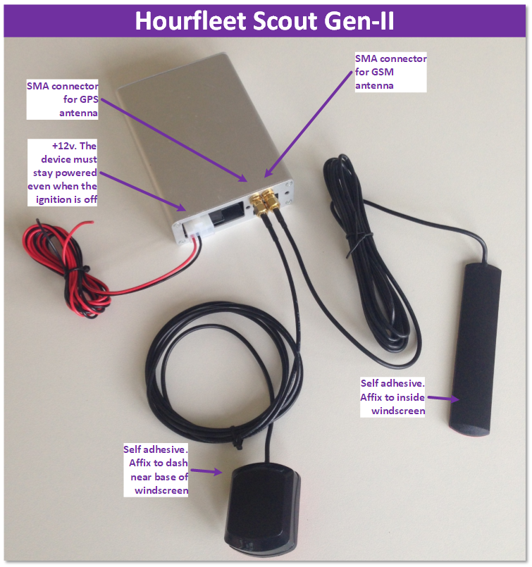

# Carkit Installation
 

### Device Placement  
Secure firmly in the glove compartment or behind the dash. It is important that the carkit’s embedded OEM proximity key can be detected by the car, otherwise ‘Key not found’ or similar will be reported on pressing the ‘Start’ button. Please consult manufacturer specifications for the internal placement of proximity key sensors.  

### Antennae
These can be affixed in the same general area, near the base of the windscreen. It is important that the GPS antenna is affixed on a level (or near level) surface, and that it has an unobstructed view of the sky. 

### Power  
Ensure 12 volt supply is not managed by the car systems. The power supply must be constant to ensure the Scout device stays operating even when the ignition has been off for some time. The device should be protected with a 5A fuse.  
  
  
# Network Connectivity
The Hourfleet carkit operates as a telemetry device, connecting to a 2G mobile data network so that car door lock/unlock instructions can be received from the Hourfleet network, and telemetry data can be transferred to the Hourfleet network. 

It will be important for you to work with your chosen carrier to ensure your carkits work correctly. Before launching your network, we suggest you confirm:
-	Your carrier has 2G coverage over the geographic areas where Hourfleet-enabled cars are expected to travel
-	You can purchase monthly data plan which supports 50Mb/month, and inbound SMS messaging. Telemetry-style data plans should cost your business less than $US4/month
-	Your carrier can supply a standard size data SIM which has an APN pre-configured. An APN is a bit like a 'carrier internal' DNS server. The mobile data network uses the APN to decide how the carkit will be allocated a real-world IP address. SIM cards may have one of more APNs pre configured. The carkit uses the APN pre-configured in PDP context #1 
- The number printed on your SIM should be 16 digits in length. If you can see only 13 digits then there are three unprinted digits which prefix the 13 you can see. You'll need to speak to your carrier as all 16 digits are required when configuring the carkit in \<yourtenancy\>.hourfleet.com. General info on this topic is [here](https://www.imei.info/faq-what-is-ICCID)
  
### SIM Installation
This is a 2nd generation Hourfleet carkit. While future versions will allow the SIM to be inserted simply, this device must be opened for the SIM to be connected to the cellular modem. The Hourfleet team will provide technical assistance as required.
