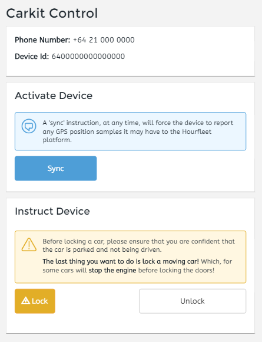

# Carkit Compatibility   
This section is intended for Hourfleet Gen-II carkit as shown in the image below. This carkit is compatible with cars that  
- Have a proximity key. These are the keys you can leave in your pocket while using the car  
- Have a factory-fitted push-to-start button

Cars that have older style twist-key ignitions **cannot** have a carkit fitted, however they can still be used on Hourfleet networks which have been configured to allow Key Exchange. Key Exchange is a feature which facilitates the car owner and renter meeting to pickup and dropoff of a physical car key.  

# Carkit Customization
Each carkit must first be customized before it is installed in the target car. This customization makes the carkit specific to that one car, and the carkit cannot simply be removed from that car and installed in another.

Customization involves our technician taking a working proximity car key, disassembling it, and installing the key's internal circuitry inside the hourfleet carkit. This is a one-way trip for that key - it can't be recovered or re-used as a conventional key ever again. 

The purchase price of an Hourfleet carkit includes the carkit itself, the customization work, and delivery of the customized carkit to any address accessible by DHL. The price does not include the cost of the car key itself, nor delivery of that key to our technician.

# Carkit Unboxing
 

### Carkit Basics
The Hourfleet carkit is simple to install. It takes a constant +12v supply and has GPS and Cell network antennae which should be mounted on th dashboard. Unlike the image above, some versions of the car kit have a plastic case affixed to the outside of the aluminium case. This is an after-market modification, necessary as we have discovered that some cars have very low power proximity sensors inside the cabin. The customised car key must be outside the aluminium case in order to be detected by the car's proximity sensor.

### Pre-Installation Testing
We recommend the carkit is tested for unlock/lock functions _before_ it is closed up inside the car. This can be done using a portabl 12v power source, or using the car's supply.

**IMPORTANT** The  carkit _is not_ reverse polarity protected, so be very carful to apply +ve to the red wire, and -ve to the ground wire. This is made difficult as not all cars have the same ground system. Please consult your manufacturers documentation.

Once the device is powered up: 
- sign in to your network administration account
- click  `Car`, then `Car Kits` 
- enter the plate number of the car that's been configured with this device
- click `control` and the panel below will be shown

Control actions can take anywhere from 10s to 30s to complete, depending on load on the cellular network. Run through the following manual tests:
1. Click `unlock` and confirm the car unlocks
1. Click `lock` and confirm the car locks
1. Click `Sync` and then periodically click the link that tracks the Sync message. Remember it could take 30s to confirm the Sync was processed and acknowledged by the Hourfleet network.

### Carkit Installation  
Secure firmly in the glove compartment or behind the dash. The automotive environment is harsh, with strong and in some off-road cases violent vibrations. Take extra car to secure the carkit for the harshest possible conditions. 

It is important that the carkit’s embedded OEM proximity key can be detected by the car, otherwise ‘Key not found’ or similar will be reported on pressing the ‘Start’ button. Please consult manufacturer specifications for the internal placement of proximity key sensors. From past experience, the internal proximity sensors tend to be near the centre console, between or near the driver and passenger seats.

**IMPORTANT**: To maximise the signal strength between the carkit and the car's proximity sensor(s), ensure the device is mounted with the red dot facing generally inwards to the car cabin. Do not mount the device with the red dot facing the engine/firewall.  

### Antennae
These can be affixed in the same general area, near the base of the windscreen. It is important that the GPS antenna is affixed on a level (or near level) surface, and that it has an unobstructed view of the sky. 

### Power  
The carkit requires a constant 12 volt supply. An increasing number of cars provide a 'managed' 12 volt supply, one where the accessor or other circuits are powered down after the car has been idle for a period of time. It is critical that the carkit **is not** subject to any such power management scheme, as it must remain continuiously powered up.The carkit should be protected with a 5A fuse.  

**IMPORTANT**: The constant operation of the carkit represents an additional drain on the car battery. If the car is left idle for long periods there is an increased risk that the car battery could run flat. The actual dischanrge timeframe will depend on factors such as the frequency and leng of use, the battery age/condition and even the temperature. Our experience is that an medium-sized car could expereince a flat battery if left unused for 3+ weeks.
  
  
# Network Connectivity
The Hourfleet carkit operates as a telemetry device, connecting to a 2G mobile data network so that digitally-encrypted door unlock/lock instructions can be received from the Hourfleet network, and telemetry data can be transferred to the Hourfleet network. 

It will be important for you to work with your chosen carrier to ensure your carkits work correctly. Before launching your network, we suggest you confirm:
-	Your carrier has 2G coverage over the geographic areas where Hourfleet-enabled cars are expected to travel
-	You can purchase monthly data plan which supports 50Mb/month, and inbound SMS messaging. Telemetry-style data plans should cost your business less than $US4/month
-	Your carrier can supply a standard size data SIM which has an APN pre-configured. An APN is a bit like a 'carrier internal' DNS server. The mobile data network uses the APN to decide how the carkit will be allocated a real-world IP address. SIM cards may have one of more APNs pre configured. The carkit uses the APN pre-configured in PDP context #1 
- The number printed on your SIM should be 16 digits length. 
- If the SIM card shows 13 digits then there are three unprinted digits which prefix the 13 that are shown. You'll need to speak to your carrier as all 16 digits are required when configuring the carkit in \<yourtenancy\>.hourfleet.com.   
- If the SIM card shows 19 digits + one alphabetic character, then the first two digits should be ignored, and the true SIM number is the following 16 digits. For example, ~~89~~1067365855460907~~6F~~. T-Mobile SIMs display their SIM number in this general form.  
General info on this topic is [here](http://www.imei.info/faq-what-is-ICCID/).

  
### SIM Installation
This is a 2nd generation Hourfleet carkit. While future versions will allow the SIM to be inserted simply, this carkit must be opened for the SIM to be connected to the internal cellular modem. The Hourfleet team will provide technical assistance if required. In some instances the carkit will have been shipped with its SIM card pre-installed.
