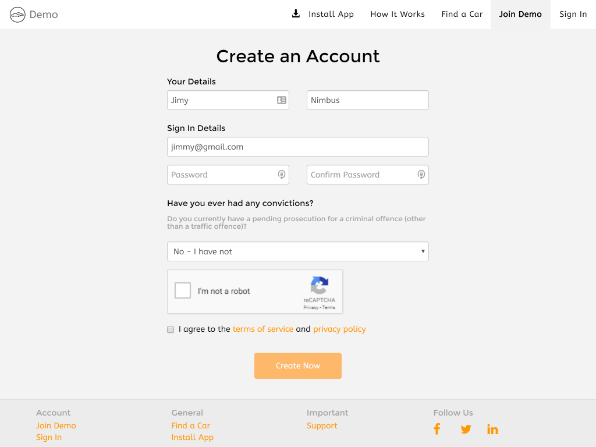

# Navigation

This section determines how the user navigates between your businesses website and the Car Share App.

We assume you already have your own business website. The Hourfleet App supports navigation between your business website and your Car Share App. 

From customer feedback, we have learned that our customers are far better off providing their own custom web pages to inform their customers of critical business information such as their Terms Of Service, their Privacy Policy and others.

Besides having your onw business website that customers will find easily on the internet, the website also provides a place to host your branding assets that you will need to customize your Hourfleet Car Share.

### Forward Navigation 

**Links from your business site to your Car Share App**  

You have complete editorial control over your business website. This gives your marketing people plenty of scope to present your brand and proposition in a way that best connects with your target market. 

As a minimum you'll probably want to publish FAQ's, About Us, your Terms of Service, your Privacy Policy and others. 

Your customers will want to jump from your business website to the Car Share App at various places in their user journey.

We recommend that you link your Car Share App from your business website in these places:

- Sign Up: `https://\<yourname\>.hourfleet.com/invite`. link your new customers to this page to create an account. 
- Sign In: `https://\<yourname\>.hourfleet.com/signin`. link existing visitors to this page to login and start using cars.
-  Search: `https://\<yourname\>.hourfleet.com/search`. link new and existing visitors to the map highlighting your available cars.

> Note: While simply links like those above are supported, many of the pages of the Car Share App are also linkable. Simply, find the page on the Car Share App you like, examine the URL in the address bar, and link to that page from your business website.  

### Reverse Navigation

**Links from your Car Share App back to your business site**

There are many links in your Car Share App that are provided for your customers to get more information about your service. These links must be provided by you to existing pages on the internet. Ideally, to your business website. 

Some of these links are very important, and must be provided:

* Home - the link to your business website landing page
* Terms Of Service - details your terms of service
* Privacy Policy - details your privacy policy

These links are optional:

* About - an about page detailing your business and mission
* FAQ - a page where you can host frequently asked questions and answers
* Support - a page used by your customers in case of an emergency, and to get direct contact with your business.
* Fees - Details about pricing and fees
* Docs - a page to read your general documentation 

When provided, you can see these links appear at the bottom of page in the footer section of your Car Share App, and in the mobile menu of the App.

> Note: If you don't want a link to be displayed, do not define it, and leave it blank.

~~~
	"Navigation": { // URL's that are linked to from your app to your own website 
		"HomeUrl": "http://www.yourcompany.com",
		"AboutUrl": "http://www.yourcompany.com/about",
		"DocsUrl": "http://www.yourcompany.com/docs",
		"TermsOfServiceUrl": "http://www.yourcompany.com/terms",
		"PrivacyUrl": "http://www.yourcompany.com/privacy",
		"FeesUrl": "http://www.yourcompany.com/fees",
		"FaqUrl": "http://www.yourcompany.com/faq",
		"ReturnUrl": "http://www.yourcompany.com",
		"SupportUrl": "http://www.yourcompany.com/support", // If defined (default is undefined), this URL will overide the navigation links to the support page Hourfleet automatically generates for you based on the values supplied in the Support Configuration section. 
		"ShowMobileAppLink": true,
		"UIElements": {
			"Invitation": { // Privacy statement about collecting their invitation data on the invitation page
				"Statement": "We value your privacy so we do not share this information with anyone else.",
				"DisplayStatement": true
			},
			"CriminalConviction": { // Compliance statement to accompany criminal conviction input.
			    	"Statement": "Do you currently have a pending prosecution for a criminal offence (other than a traffic offence)?" 
				"DisplayStatement": true
			}
		}
	},
~~~

You can see an example of all the links in footer of the Car Share App:

  

## SupportUrl

By default, the `SupportUrl` will be blank, and a generated support page will be provided containing the information you provide in the [Support](configure-support.html) page.

You can choose to override this default and provide a link to your own support page.

## UIElements

The `UIElements` node provides information in various places in the Car Share App that can be customized.

### Invitation Privacy Statement

When a user signs up to join your Car Share they will see a page like the one below containing a simple message about the information that will be collected from them.

In this case,  the custom message says: *"We value your privacy so we do not share this information with anyone else."*

### Criminal Conviction Statement

When a user completes the registration to sign up to your Car Share, we ask them to declare their criminal convictions. They see a page like the following, with a statement about declaring their convictions

In this case, the custom message says: *"Do you currently have a pending prosecution for a criminal offence (other than a traffic offence)?"*

You may want to use this message to state the exact legislation of your jurisdiction required to be stated in this case.