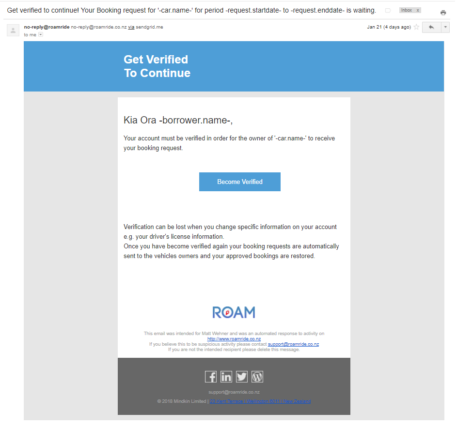

# User Notifications

At various times, your customers are going to get notifications sent to them via email or TXT message (or both). 

If you wish, you can also customize the content of all of these messages, both the email content and the TXT message content. 

## Notification Parts

There are 3 kinds of notifications:

- Email notifications
- SMS Text message notifications
- Notice notifications (In-App alerts)

SMS text message notifications, and notice notifications are only single lines of text only (no markdown is supported).

An email notification comes in both an HTML version and a plain text version. We define a HTML and plain text version because still some email clients only support plain text. The plain text version is also often used in inbox lists for summaries in some email clients. The structure of an email looks like this:

- Header - Often just a title
- Content
- - ​	Salutation - a greeting like "Welcome" or "Hi Jim Smith"
  - ​	Paragraphs - multiple lines of individual content
  - ​	Action - an optional call to action link at the end of the main content, often a button to press.
- Footer - bottom of the email containing branding and other links.

##Custom Configuration

You can see all the different type of notifications [on this page](notifications.html).

> Note: Customization is optional. You would only provide configuration for the notifications you wish to customize. And for each notification you only need to provide the elements of it you wish to customize. Leaving any part of the configuration blank, results in default content for each of those parts. 

The following example shows the configuration for a customization of the notification: `101`. 

~~~
"Notifications": {
    "Templates": [{
            "Id": 101,
            "Email": {
                "Subject": "Get verified to continue! Your Booking request for '-car.name-' for period -request.startdate- to -request.enddate- is waiting.",
                "HTML": {
                    "Header": ["Get Verified\nTo Continue"],
                    "Salutation": "Kia Ora -borrower.name-,",
                    "Content": ["Your account must be verified in order for the owner of '-car.name-' to receive your booking request."],
                    "Action": {
                        "Text": "Become Verified",
                        "Url": "https://demo.hourfleet.com/settings/account"
                    },
                },
                "PlainText": {
                    "Header": "Get verified to continue.",
                    "Content": ["You must get verified in order for the owner of '-car.name-' to receive your booking request."],
                }
            },
            Sms: {
                "Content": "Get verified to continue. Your booking of '%car.name%' is waiting. See %request.url%"
            }
        }
    ]
}
~~~

- 

## Customizable Elements

The configuration above defines your customization of the default notification.

There are several parts you can customize. Lets look at each one.

Firstly, you can define a customization for all of the parts, or only the ones you want to customize. The parts are:

- **Email.Subject** - provide this only if you want to customize the mail content. Do not include this element if you wish to use the default subject line.
- **Email.HTML** -  provide this only if you want to customize the HTML version of the email. Do not include this element, if you wish to use the default HTML version.
  - **Email.HTML.Header** - provide this if you want to modify the header section of the email. Do not include this element, if you wish to use the default header.
  - **Email.HTML.Salutation** - provide this if you want to modify the salutation of the email. Do not include this element, if you wish to use the default salutation.
  - **Email.HTML.Content**- provide this if you want to modify the main HTML content of the email. Do not include this element, if you wish to use the default content. Each paragraph is a separate line of text in an array. Each line of text can include Markdown syntax. If you want to include bullet points, tables, or hyperlinks.
  - **Email.HTML.Action**- provide this if you want to modify the main call to action (button) in the email. Do not include this element, if you wish to use the default action. You can customize the text and the hyperlink.
  - **Email.HTML.Footer** - is not customizable.
- **Email.PlainText** - provide this only if you want to customize the plain text version of the email. Do not include this element, if you wish to use the default plain text version.
  - **Email.PlainText.Header** - provide this if you want to modify the header section of the email. Do not include this element, if you wish to use the default header.
  - **Email.PlainText.Content**- provide this if you want to modify the main HTML content of the email. Do not include this element, if you wish to use the default content. Each paragraph is a separate line of text in an array. Each line of text can include Markdown syntax. If you want to include bullet points, tables, or hyperlinks.
  - **Email.PlainText.Footer** - is not customizable.

- **Sms.Content** - provide this only if you want to customize the SMS message and Notice. Do not include this element, if you wish to use the default message. Note, substitutions in this content are always surrounded by `%` signs for example: `%car.name%`

## Example Email Notification

Here is an example of the default email message for notification `101`, branded for the 'Roam' network.

> Note: that the section contain substitutions (between the characters `-`) for example `-car.name-`. 
>
> By including these substitutions in the text, you can plug in those values from the notification itself. You can see the appropriate substitutions for each notification in the [Notifications](notifications.html) page.

