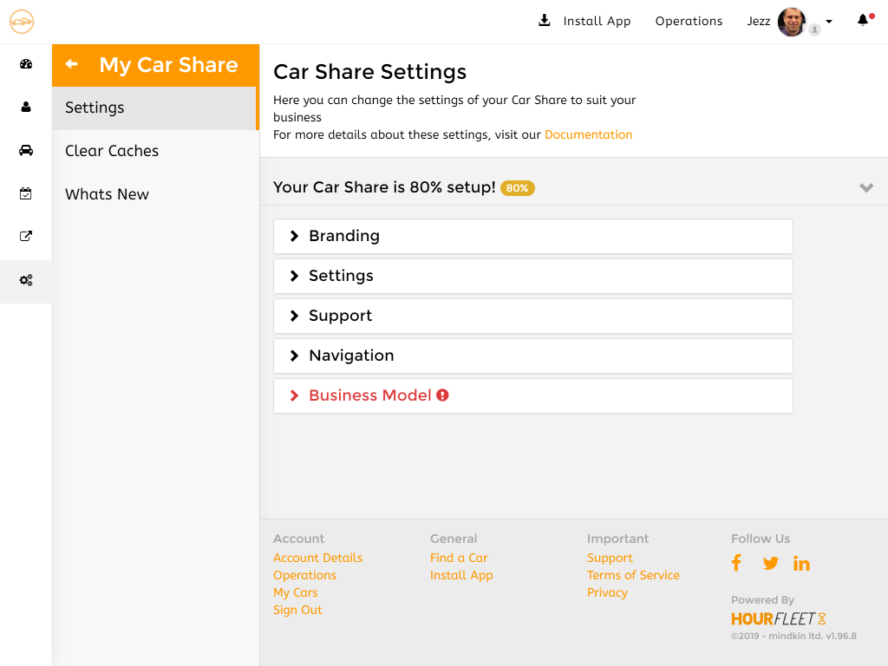

# What you can configure

When you join Hourfleet and create a new Car Share, you are going to get your own car sharing [Web App](app.html), hosted for you at an address like: `https://yourcarshare.hourfleet.com`.

The Web App will still need to be configured to work the way your business does, and tailored to look like your business.

You can see a quick example of what your web app could look like at: [Demo Car Share](https://demo.hourfleet.com). Just imagine your brand and your business rules applied to it.

## What is a Network Operator?

Just quickly, lets define a term or two.

From the perspective of Hourfleet, you (and your business) are known to Hourfleet as a "**Network Operator**", since you operate a Car Share '**network**' on the Hourfleet platform. A distributed network of borrowers and cars.

As an '**Operator**' (for short) you will have very special privileges to configure and operate your Car Share. 

You are very likely to have many things unique to your business, such as: your own brand, your own social media presence, and also different rules about how you price your services and how you charge your customers for renting and borrowing cars on your network.

You are also very likely to already have your own homepage website for your business that is focused upon capturing new customers and providing that all important front door to your business, and turn interested customers into paying customers. 

You will definitely want to keep that website alive, and so, as well as that the Hourfleet App will 'extend' your website to provide all the tools you and your customers need to run your car sharing business. Its essentially another Web App that will look like its yours to your customers.

There is lots to configure for your specific car sharing business and how the Hourfleet App should look and behave. 

# Let's Configure Your Settings

> IMPORTANT: At this time, we are still building out the self-serve configuration experience right inside the Hourfleet App, so that operators like yourself can make these configuration changes directly yourself. 

You can configure all the settings of your Car Share right now in the 'Operations' dashboard of the web app.

* Sign in to your Car Share (as your operator account), you should be taken to the 'Operations' dashboard automatically. 
* From the left menu select 'My Car Share', then select 'Settings'.

## Other Settings

> Note: In the interim, for the sections that you cannot change in the Operators Dashboard right now, please send your changes (text, links and images) to Hourfleet Support in you private Slack channel or email to [support@hourfleet.com](mailto:support@hourfleet.com) and we will make the updates manually for you.

See those settings here:

- [Business Model](configure-businessmodel.html) define the rules around how car sharing works in your business

- [Notifications](configure-notifications.html) we send a lot of notifications to you and your users, tailor them if you need to

