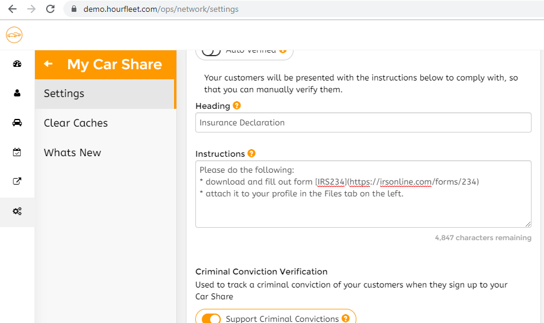
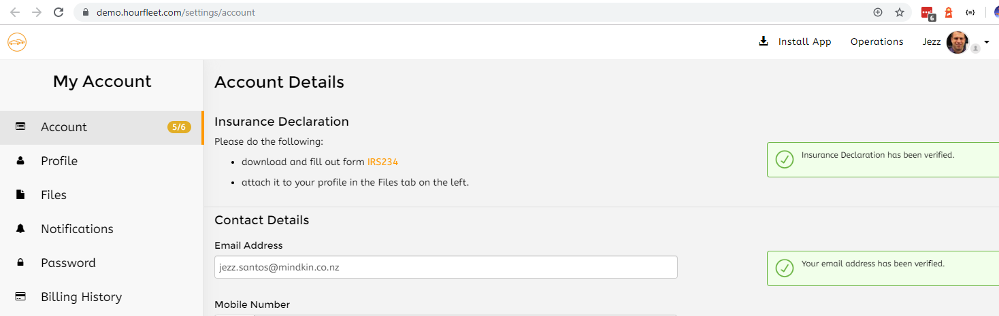

# Custom Verification

Hourfleet has a rich verification system. Verifications as used to ensure that personal details that are supplied by your customers are verified and genuine.

Car borrowers, car owners and cars themselves each have a number of verifications that must be in place before a rental can take place. These verifications include things like phone, email, drivers' licence, road worthiness certificates and others.

In addition to these built-in verifications, you can configure an optional verification for your customers to collect from them additional information your business may require. 

For example, you could require them to upload a Driving Record (Canada), or an Insurance Certificate (USA), before you permit them to participate in renting a vehicle. 

> Note: If you require them to upload of photo or a file, you can direct them to that on the Files page of their profile. Or perhaps send an email to your business with some details you require.

## Enabling Custom Verification

In Hourfleet, we call this verification the 'Operator Verification', and you configure whether to use it or not, in your Car Share Settings.

To enable the Operator Verification:

1. Sign in as an operator 
1. Navigate to My Car Share -> Settings, and expand the 'Business Model' section.    

1. Switch OFF 'Auto Verify' 
1. Add a heading to the verification 
1. Add some instructions which guide your customers. Note that you can include Markdown, with links, bold text etc  
1. Scroll down to the end of the section and click 'Save Changes'  

That it!

Your customers will now be guided to follow your verification instructions when they register.

>Note: Enabling the Operator Verification will not result in any existing customer becoming unverified, they will already be verified, which may require you to un-verify them manually, to force them to comply with your instructions.

