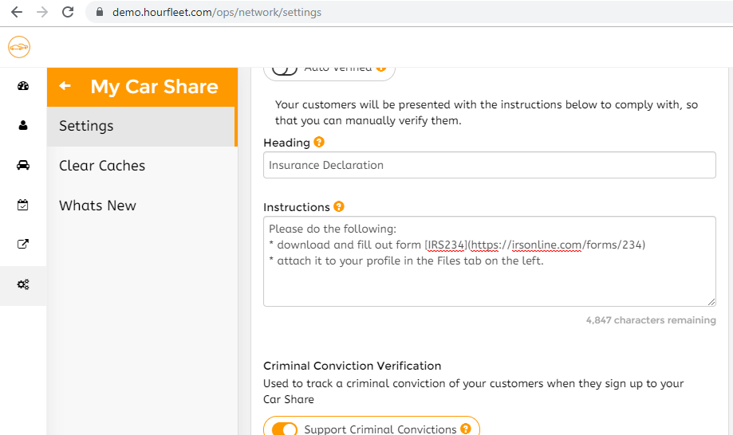
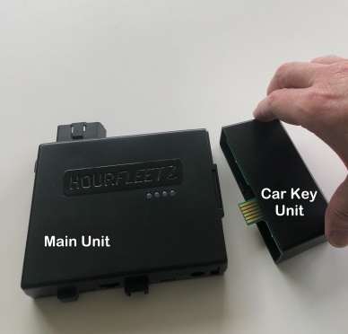

# Custom Verification

Hourfleet has a rich verification system. Car borrowers, car owners and cars each have a number of verifications that must be in place before a rental can take place. These verifications include things like phone, email, drivers' licence and more.

In addition to these in-built verifications, you can configure and describe one general verification for your customers to comply with before you manually verify them. This could be directing them to upload their Driving Record (Canada), or their Insurance Cetrificate (USA). 

  
