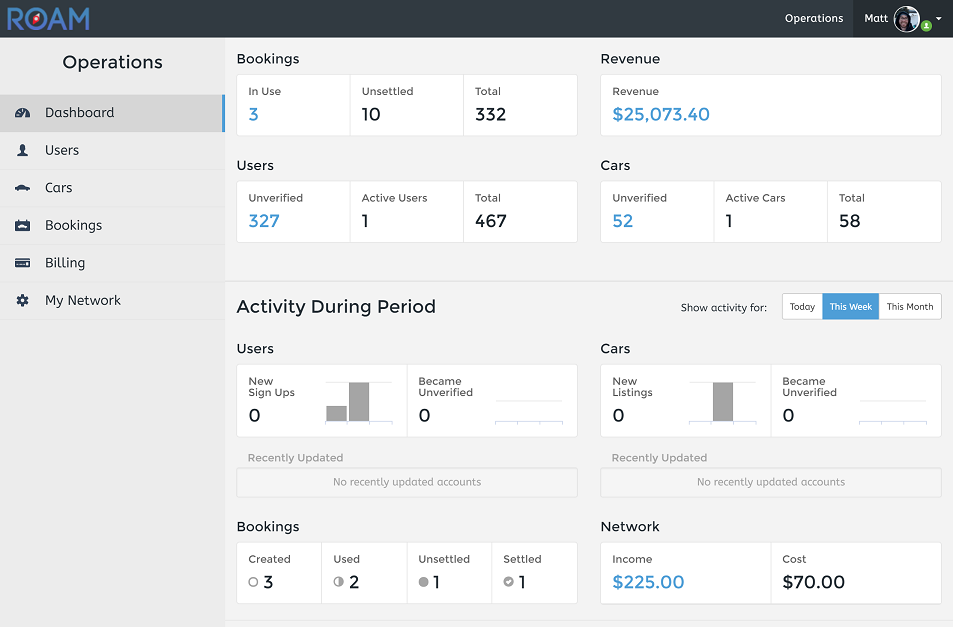
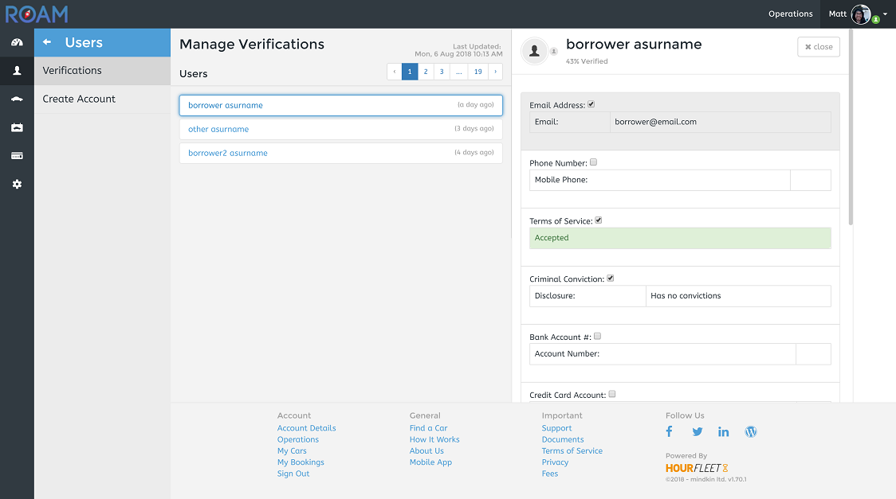
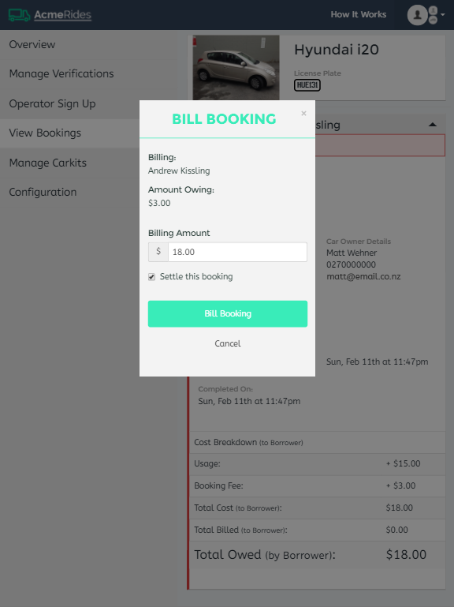
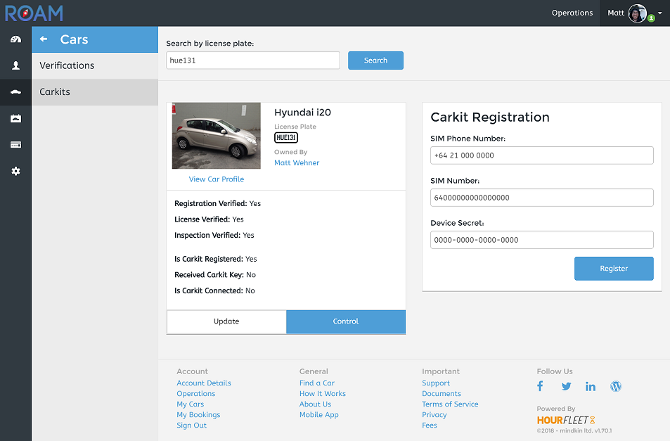
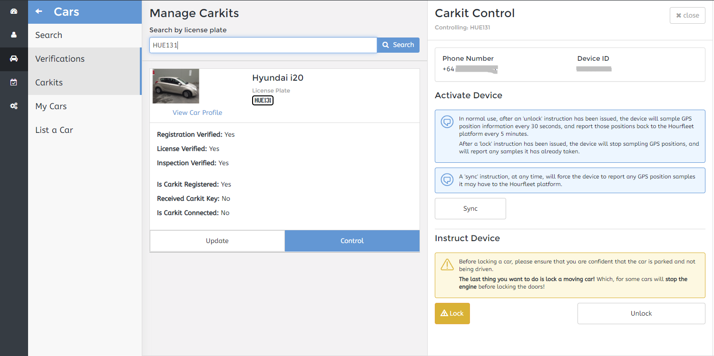
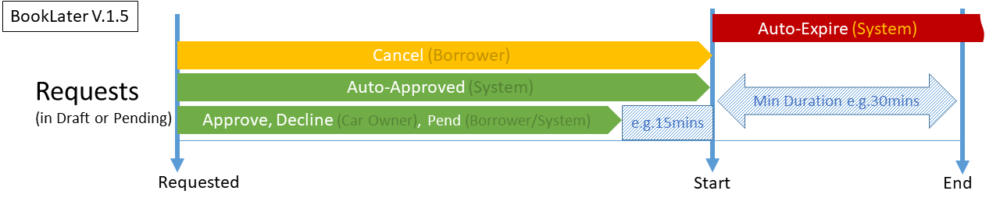
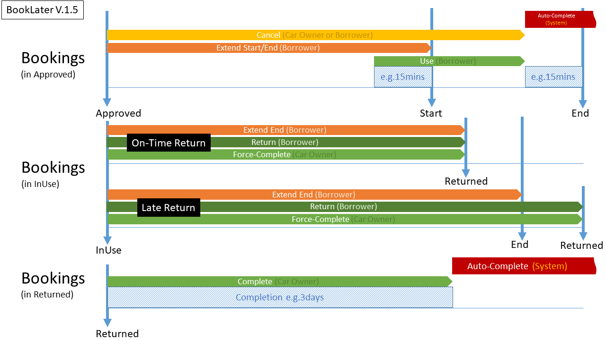
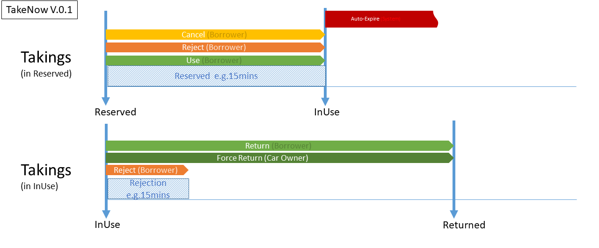

# How Things Work

Hourfleet helps you create and operate your own car sharing business. Knowing how it works will help you optimize the experience for your customers.

Let's get right to talking about how your customers buy 'usage' of cars on your network.

Typically, your car sharing business at some point is going to have its own website, and it is likely to have one or more landing pages where you attract, advertise, track and convert viewers to paying customers of your services.

Your website is likely to contain information such as: Pricing Plans, Fees, Terms of Service, Privacy Policy, Customer Case Studies, Company Info and other information. Typically in multiple pages (URL's) on your website. For the purposes of this documentation, we will refer to these pages of your website as the 'Landing Pages' of your car sharing business.

New users to your website are likely to spend a bit of time on your website checking things out and seeing what you have to offer, and what others are saying about what you offer and how good the service is. Then a some point, hopefully son after, they are going to want to try out your service, register an account, and be led by the site to explore and try out your services for themselves.

At that point you are going to need an app that users can use to find available cars, making bookings or reservations for those cars, and then use the app to acces and use the car. If you are going to use keyless technology in your cars, your users are going to need that app to lock and unlock the doors of the cars too.

This app has to look and feel like your business, and has to integrate seemlessly with your existing website.

As a tenant on the Hourfleet platform, we give you your own branded app that will look and feel like your website and landing pages, and the app manages the seamless navigation between them so that your users feel comfortable moving around from your existing website into and out of the app depending on what they are doing at any one time. To your users the experience will be seamless. However, to the observant types, in actual fact, the Hourfleet web app will be hosted for you at a different URL than your website, at: **https:\/\/\<yournetworkname\>.hourfleet.com**

You can see from the example image below, for the car sharing network **Roam**. The site of the left is the existing Roam business website (roamride.co.nz), and the site on the right is the Hourfleet web app for Roam (roamride.hourfleet.com). Both sites work together to give a full experience for Roam's customers.

> Notice: the links on the left side for 'Find a Car', 'List a Car' and 'Sign In' all link to pages in the Hourfleet web app on the left. Conversely, the links in the footer in the Hourfleet web app on the right link to various pages in the business website  on the left. The branding of the Hourfleet web app mimics that of the business web site on the right.

### Table of Contents

- [Web App Integration](#web-app-integration)
  - [Customer Support Page](#customer-support-page)
- [Operational Management](#operational-management)
  - [Activity Monitoring](#activity-monitoring)
  - [Verifications](#verifications)
  - [Billing/Remittance](#billingremittance)
  - [Carkit Management](#carkit-management)
- [Listing Cars](#listing-cars)
- [Borrowing Cars](#borrowing-cars)
  - [Usage Models](#usage-models)
- [Cloud Hosted Environment](#cloud-hosted-environment)

## Web App Integration

The Hourfleet web app is where your customers will manage their account with your car sharing network, manage their profile, and they will book/reserve and list cars there too. Basically, they do everything to do with cars in the web app.

The Hourfleet web app however will not be able to provide things to your customers like: your Terms of Service or Privacy policy, etc. But instead, it will provide the ability to link users to those things on the landing pages of your own website, from various links in the Hourfleet web app.

The list of links in the web app that link to your website are:

- **Home** (Landing Page) - the user is returned here after logging out of the web app.
- **Terms Of Service** - the user is directed here to read your terms of service, generally when being asked to accept them.
- **Privacy Policy** - the user is directed here to read your privacy policy in places where information is taken from them.
- **How It Works** - the user is directed here to read about how your network works, and reads any information specific to how your network works.
- **About** - you can provide information about about your business or people
- **Contact** - you can provide information for contacting the people and services of your business  
- **Fees** - you can provide pricing and fees information
- **Documentation** - A place you can provide additional documentation, like forms, etc.

> Note: The 'Home' link must always be defined. All other links are optional.

An example of the links in the Hourfleet web app can be seen in the footer section of the web app. It looks something like this, depending on which links you enable:

All of the links in the list above (except the 'Home' link) can be optionally enabled, or hidden if not required. See [You Configure](http://docs.hourfleet.com/youconfigure.html) for the technical details.

### Customer Support Page

In addition to all the pages above, the Hourfleet web app offers you a ready made pre-formatted 'Support' page that displays support contact information and insurance information for your customers to use when they need assistance using the web app, or assistance when borrowing cars out on the road.

This support page is pre-formatted with information you provide in your tenancy configuration. An example of the support page can be seen here.

## Operational Management

The Hourfleet web app includes a number of administration pages to help you operate and monitor your car sharing network. These administration pages are only available to privileged users of the Hourfleet web app.

> Note: You can control and nominate one or more people in your business to manage your business in the administration pages of the web app. Those people will log into the web app just like your customers, but they will have access to a number of tools that your customers would not see and not have access to.

These tools include the ability to:

- Monitor activity on your network, such as when new users register, when users create bookings, etc.
- Manage your user accounts and their verifications.
- Manage the charging and remittance of your customers.
- Configure, manage and test your physical keyless devices.

> Note: Hourfleet is constantly striving to provide its customers with the most relevant tools for managing your network. So please let us know what is missing and we will try to provide you the best experience for managing your network.

### Activity Monitoring

As your customers do various things on your network, such as: create new accounts, verify their credentials, book and use cars, etc. 
These activities are collated and summarised on the Operations Dashboard.  

### Verifications

In a car sharing network people must trust each other to borrow and rent vehicles. The car owners must at least trust the network that borrowers are legally qualified to drive their cars, and borrowers must at least trust car owners that cars are legally safe to drive. Everyone on the network, borrowers and car owners will want trust to some degree that everyone involved is legitimate, and the network has limited that kind of risk as much as it can. 

Since many people may be using the network or specific car for the first time, trust will likely be inferred from the other party's network membership and from the feedback and rating given by others on the network about them.

For these reasons, and others, all Hourfleet networks support two things: Verifications and Ratings and Reviews.

#### Ratings and Reputation

<<screenshot of ratings starts and perhaps a review>>

Rating and reviews are well understood today. People using a service (i.e a car sharing service) get the option to rate and give open and honest feedback about their experience of the service, and of the people providing it to them. They typically do this in the hope that it helps or benefits others coming after them to make an informed purchase choice. Today, with many online services, this is a common experience, and is expected whenever it's difficult to establish initial trust between the individuals participating in the service (i.e. between the owner of the car, and the person using it temporarily). Your car sharing network is no different, where many people may not have extensive experience with the other people providing them service. Particularly in the P2P networks, feedback and ratings are critical to making it succeed.

In terms of qualifying people and qualifying the minimum level of service they provide (i.e. renting their car), ratings and feedback are not enough to define a minimum level of quality. Every car, car owner, and borrower needs to be verified as well.

#### Getting and Staying Verified

<<screenshot of verification labels>>
<<graphic of a verification tick>

Every user and every car on your network will have its own set of verifications. Depending whether you are a borrower, car owner or car, your set of verifications will differ. For example, a borrower must have at least: a verified email address, a verified phone number, a verified credit card and a verified drivers license. A car owner must have at least: a verified email address, a verified phone number and a verified bank account. A car must have: a verified license plate and a verified certificate of road worthiness.

Whenever a person or car is registered on your network, there is an ongoing process which they must go through continuously to complete and maintain their list of verifications. They must get and stay fully verified to continue to fully use the service. Until they are fully verified, their use of the service will be limited. For example, until a borrower is fully verified they will not be able to actually use a car. Similarly, until a car is fully verified, borrowers will be unable to book or rent that car. Some activities like finding a car do not require being completely verified.

Some of these verifications, like: car license plate, are not going to change over time. Some of these verifications, like an email address, will only change if the user manually updates them. Some of these verifications will automatically change over time, like a drivers license, or credit card, when it expires.

Some of these verifications can be automatically verified by the Hourfleet system, such as a person's email address or their credit card, etc. Other verifications like a drivers license, and possibly a car's license plate, can only be manually verified by the Network Operator, typically by way of some other government service/system.

The network operator, your business, is therefore responsible for monitoring and managing these verifications for the users of the network. 

The Hourfleet web app provides the tools from the Operations Dashboard to monitor and manage verifications of all users and cars as things change. i.e. as a new user registers and provides all the information to get fully verified.

> Note: Monitoring and managing verifications is a mandatory activity for network operators, and must be performed continuously, as users and cars on their network can change status over time.

### Billing/Remittance

When a borrower of a car on your network has used and returned the car, they will need to be charged for that usage. Charges are always charged to a verified credit card.

The owner of the car in a P2P business will also need to be remitted an amount for the use of their car. In a B2C business, the operator is the car owner, and will also need to be remitted for the use of the car. Remittance is always paid to a verified bank account.

While usage charges and remittance can be calculated and could technically be performed automatically by Hourfleet, doing this automatically for every usage is not always desirable for a network operator. For example, if one of your borrowers has had a very poor experience within your network, you may decide as the network operator to discount or waive usage charges for them on a case by case basis. 

For these kinds of reasons, some charging and remitting in Hourfleet must be performed manually after the fact, by the network operator. 

All remittance and charging is performed after a booking is closed out and settled by the car owner, and is added to a backlog that can be managed by operators.

> Note: the amount to charge a borrower, and the amount to remit the car owner, is always automatically calculated for you to make the act of reconciling the charges and remittance as easy as possible.

The Hourfleet web app has all the tools to manually view all charges and to manually bill the user.

#### Usage Charges and Settlements

Each Hourfleet tenancy decides its own financial model for how its car sharing network charges borrowers and remits its car owners. The financial model in all cases can be quite complex depending on your commercial arrangements with: your customers (borrowers and car owners) and your insurance company.

> Note: In a B2C car sharing network, the network operator is typically (but not always) the owner of the cars on the network (a car owner could also be a 3rd party), whereas in a P2P car sharing network, other members of the network typically (but not always) own the cars. Car ownership should be understood to be separate from whether the network is B2C or P2P.

Referring to the [network operator configuration](youconfigure.html#business-models) you can see the various options you have in the financial model of your car sharing network. Notice that your car sharing network will support either a B2C model, or a P2P model, not both. 

In a B2C model, a network operator typically owns the cars, and is remitted all the usage charges, less any payouts it must make to an insurer.

In a P2P model, a network operator typically shares the revenue generated by borrowers renting out the cars of the car owners, less any insurance payouts.

In either model, insurance payouts can be a combination of a fix fee, plus some share rate, or none of these things.

> Special Case: Special car sharing networks like: trial networks, promotional networks, or wholly-subscription based networks, may not want to charge borrowers anything for using any of the cars on the network, and therefore there will be no revenue from usage at all.

This B2C and P2P parts of the financial model determine the fixed revenue of the business. The variable amount of revenue generated by usage of the cars by borrowers is determined by the 'Usage Model' or each car. Both B2C and P2P models support both 'Scheduled' and 'Immediate' usage models.

In a 'Scheduled' model, where cars are 'booked' ahead of time for a known period of time, revenue depends on the hourly/daily/weekly prices set by the car owner. Actual revenue depends on how much (to nearest minute) of usage the car is used by the borrower within the schedule. Late fees and fixed penalties are mandatory for schedule infractions, depending on tolerances set by the network.

In an 'Immediate'model, where cars are not booked, but used on demand (if available), for an unknown period of time, revenue also depends on hourly/daily/weekly prices set by the car owner. Revenue depends on how much (to nearest minute) of usage the car is used by the borrower. Late fees and penalties are only used in cases of gross over usage depending on maximums set by network operator. 

In either model, there are also booking fees per usage that can be applied, and various timescales that can be defined controlling late fees and fixed penalties.

Together, both the 'Ownership' and 'Usage' models provide the financial models for actual charges and remittance for both borrower and car owner.

> Note: In the Hourfleet web app, when it comes time to calculate any charges or remit any settlements, a full breakdown of the amounts will be presented to the user.

### Carkit Management

If the cars on your network support keyless access by smartphone, each car will need to have a car kit installed within it. The car kit is paired with the car after it is installed physically in the car.

> Note: the installation of carkits is not covered here. But once physcially installed into a car, the carkit will need to be removed and re-configured to be physcially installed into another car.

Typically, after installing the car kit physically into the car, the installer of the car kit will need to pair the car kit with the car in the Hourfleet web app. They would do that in the 'Manage Carkits' page of the web app.

To pair a car kit with a car in your network you will need to know the following information:

- The SIMM identifier of the car kit. This is printed on the actual car kit.

Once the car kit is paired with a car on your network, you can manually operate various functions to test the car, including Locking and Unlocking the car.

> Note: if one of your customers get in trouble while using a car, this is the same function you can use to help them Lock/Unlock their car.

## Listing Cars

In order for a car to be 'seen' or used on your network, the car needs to be 'listed' on the network by one of the current users on the network. The listing of cars for P2P networks is usually done by the owner of the car. For B2C networks, cars are listed by the network operator, or perhaps some 3rd party.

Once a car is listed, there is quite a rigorous process by the car owner to get it verified so that it appears in search results for borrowers to find. 

Generally, the following must be configured before a car will be seen in search results, in order for it to be borrowed.

1. The car must be fully registered, and have all the basic information filled out. e.g. Year, Make, Model, Location, Photo, Prices, Usage Model, etc. (The app displays green ticks and checklists to help you see what is still missing here).
2. The car must have details of a Certificate of Road Worthiness, and this must be manually verified by the operator.
3. The car owner must be fully verified as a car owner. Requires the owner to have a verified: Email, Phone and Bank Account, and these must be manually verified by the operator.
4. The car must have some future availability set for it by the car owner. This can be for any date in the future for any period of time.
5. The car must not be manually set as 'Offline' by the car owner.

Only when the above requirements are met, will the car appear in the search results (and on the map) as 'Available'. 

Cars that do not meet all these requirements, but are fully registered, appear in the search results (and on the map) as 'Coming Soon', and cannot be booked or used.

> Note: At any time, any of the car's verifications and any of the car owners' verifications may become unverified (some are time based, some are action based - see [Verifications](#verifications) for more details), at which point the car becomes unavailable, and disappears from the list of 'available' cars in search results (still visible on the 'unavailable' cars in search results.

For car owners (P2P or B2C), it is imperative that they get themselves and their cars verified, and stay verified if the cars are to be used.

> Note: It is imperative that operators stay on top of any manual verifications that would block cars from being fully verified at any time.

## Borrowing Cars

To borrow a car on any network the borrower must be registered on that network, and they must be fully verified.

To be fully verified a user must first:

1. Create an account on the network, by providing an email and name, and accept the terms of service of the network.
2. Verify their email address (an email is sent to them for this purpose)
3. Verify their phone number. This is currently done manually by the network operator.
4. Provide their drivers license in their profile. The network operator must verify this manually.
5. Provide their credit card details in their profile. This is automatically verified when they register their card.

Only when the user has completed the above checklist will they be able to actually use any car on the network. 

In the meantime, as long as the user has created an account on the network, they will be able to make requests to book 'scheduled' cars, but will still need to be verified before it is time to use the car, otherwise the booking will expire.

> Note: if at any time the user becomes unverified, the ability to use a car is restricted until they restore their verifications.

### Car Usage Models

There are two basic usage models that govern how borrowing a car works on your network:

- Scheduled - (a.k.a Book Later) In this model, cars must be booked in advance, and are generally booked for a specified amount of time by the borrower. The borrower shows up at the car and uses it at (or very close to) the time they booked it, and return it before the scheduled end time. The car owner gets the option to approve requests manually ahead of time, and they can choose the best booking request to fit their needs (i.e. times, durations, costs, reputations etc.) if they get more than one booking for the same time period. Or, they can choose to auto-approve the requests and requests are approved as long as the car is available (first in first served).
- Immediate - (a.k.a Take Now) In this model, there are no bookings, and no approvals. Borrowers walk up to a car wherever it physically is and reserve it right away. They have a short period of time to actually use the car (i.e. a short amount of time to start the rental), before it becomes available to others to reserve and use. The borrower uses the car as long as they like (within max limits set by the network operator), and returns it when they no longer need it.

The usage model is set for each and every car. Any network can support cars with either or both these usage models at the same time. The car owner can change the usage model anytime (except under certain circumstances). For example, a car can be setup for the 'Scheduled' usage model and borrowers can make bookings and use the car. Some time later, the car owner may decide to switch to the 'Immediate' usage model, and now borrowers can take the car immediately anytime its not already in use, no bookings required.

> Note: A car owner cannot swap from 'Immediate' to 'Scheduled' when there are future booking already scheduled for that car.

#### Scheduled Bookings

Bookings work like most people imagine they should, with some interesting limitations: 

- First, a borrower makes a 'Request' to rent a car for a specific period of time. Minimum and maximum durations are configurable by the car owner. The borrower gets the chance to ask a question of the car owner, for example: "I'd like to take my child with me on this trip, would you be able to include one of your baby car seats in the car please".
- A booking 'Request' is sent to the car owner to approve. (Unless the car owner has configured the car for auto-approval, in which case, the request is immediately approved - as long as the car is available). 
- The car owner, when they get to it, looks at all their booking requests and considers which to approve, or which to decline. If there are multiple requests for the car at the same time, the car owner will compare the requests to see which works out best for them, approve one or none, declining the others.
- If a car owner does not approve or decline a request up until a configurable time span (e.g 15mins) before the booking should actually start, then the request is automatically expired. Car owners in this model should remain responsive to booking requests to keep borrowers happy. 
- If a request is approved, then the borrower is notified. The schedule, home location, and prices are locked in for the borrower.
- Before the booking is due to start, the borrower has the option to request an extension to the schedule, but only if the car is available for that extension time.
- Before the booking actually starts, the borrower will use the app to find the car (a location displayed on a map). 
- The borrower has the ability to start the booking early within another configurable time span (e.g 15mins) of the scheduled start, as long as the car is at the home location, and only if there is no booking of the car, and it is not currently in use.
- The borrower starts the booking (in the app), they open the car (from app if keyless) and they drive it away. 
- They will have up until a configurable period (e.g 15mins) before the scheduled end of the booking to actually start the booking and use the car, otherwise the booking will expire, assuming the borrower did not show up to use the car.
- During the use of the car, the borrower will have the option to extend the scheduled end date of the booking, as long as the car is not already scheduled for another booking during that period.
- After use, the borrower must return the car to its agreed home location, or within a tolerable distance defined by the car owner. In some cases, like urban on-street parking, it may not actually be possible to return the car precisely to its designated home location (as the park may be occupied), so the borrower must make an effort to park it as close as possible to that location. Ultimately, the car owner will decide whether the final location is acceptable to them or not. There can be penalties applied should the car owner decide it was not acceptable.
- The borrower locks the car and completes the booking (in the app). They then have the option to leave a rating and some feedback about their experience of the car to the car owner. On a P2P network these become publically visible to other borrowers, but they are hidden from other borrowers on a B2C network except to network operators.
- If the borrower returns the car late, and its more than (e.g 5mins) past scheduled end time, then a one time late fee penalty is applied (e.g \$50), and for every minute late there is an hourly late fee applied (e.g \$1/min).
- After the borrower returns the car (in the app) the owner can review the final booking, and must accept the final situation of the car. They can choose to give feedback at this point about the condition and location of the car. 
- If the car owner does not complete the booking within a configurable period (e.g 3 days) the booking is auto-completed on their behalf, so that billing and other functions can commence.
- Finally, once the booking is completed, the borrower is charged all usage/late fees, and the car owner is remitted their earnings.

> Note: In the points above, all configurable times and costs given are defaults, and are configurable for your specific network. These settings are all defined in your configuration for the 'Scheduled'. usage model. See the [configuration](#youconfigure.html#business-model) for more details.

This diagram illustrates the timings and limits involved in making a booking request, before its approved, with example timings. 

This diagram illustrates the timings and limits involved in using a car and completing a booking, with example timings. 

#### Immediate Takings

'Takings' is the informal name given to rentals that use the 'Immediate' usage model. Takings work very differently to bookings even though from a borrowers perspective the differences may be very subtle.

This model suits car sharing businesses where on-demand service is required. Typically, for B2C type networks where the cars are branded, and location and expediency to drive away are required.

- First, a user does not need to make a booking for a car. There is no request. There is no schedule.
- A borrower simply finds an availble car (in the app) either physically away from the car or physically next to the car (i.e. standing next to it). 
- They 'reserve' the car (in the app), and then have a configurable period of time (e.g. 15mins) within they must start their rental. The reservation typically happens outside the car, and in some cases the borrower can be still traveling to pick up the car when it is reserved. 
- If a borrower does not start the rental in the given 'reservation' time, the reservation expires and the car becomes available for other borrowers to reserve it. (or the same borrower has to make another 'reservation' for it).
- At this time, the borrower has the option to cancel the rental at no cost.
- The borrower then unlocks the car and (in the app) starts the rental.
- The borrower has the chance to provide feedback about the car prior to using it, e.g. the condition of the car before they use it.
- The borrower can then drive the car away.
- A borrower then has a configurable window of 'grace time' (e.g 15mins) to 'Reject' the car if they wish. If they reject the car, they must return it, and the rental is not charged. This period is to allow for the cases where the borrower starts the rental and then discovers a problem with the car, that is not acceptable to them. (i.e. a flat tyre, or unacceptable condition inside the car).
- The borrower drives the car away, and uses it for an indefinite period of time. In this model, there is no scheduled period of time for the rental. However, there if a configurable maximum length of rental (e.g. 4 days) set by the network operator.
- After use, the borrower must return the car to its agreed home location, or close by. In some cases, like urban on-street parking, it may not actually be possible to return the car to its precise designated home location (as the park may be occupied), so the borrower must make an effort to park it as close as possible. Ultimately, the car owner will decide whether the final location is acceptable to them.
- If the borrower returns the car and its more than the maximum rental length (e.g 4 days) a one time late fee penalty is applied (e.g \$50), and for every additional minute late there is an hourly late fee applied (e.g \$1/min).
- After the borrower returns the car (in the app) the owner can review the final booking, and must accept the final situation of the car. They can choose to give feedback at this point. If the car owner does not complete the booking within a certain time span (e.g 3 days) the booking is auto-completed on their behalf.
- Finally, once the booking is completed, the borrower is charged all usage/late fees, and the car owner is remitted their earnings.

> Note: In the points above, all configurable times and costs given are defaults, and are configurable for your specific network. These settings are all defined in your configuration for the 'Immediate'. usage model. See the [configuration](#youconfigure.html#business-model) for more details.

This diagram illustrates the timings and limits involved in using a car and completing a taking, with example timings. 

#### Keyless Access

<<screenshot of the keyless device>>

For cars that support Keyless access, borrowers must walk up to where the car is located, and from their smartphone, in the app, they start their 'booking' (Scheduled) or 'rental' (Immediate) to open the car. Once inside the car, there will be a 'Start' button on the dashboard to start the car and drive it away.

While they have the car the app will display their location on a map and shows them where to return the car when they are done. The app also keeps track of the usage time, costs, and fees for them. They can lock and unlock the car at anytime during their booking using the app.

When a borrower is done and returns the car, they will complete the booking/rental in the app, ensuring the car is returned to the correct location and is left locked. They can review their charges and give feedback at that point.

Later, the borrower can view their past booking/rental in the app and they will be billed by the network operator.

> Note: if the car has keyless access, and the car owner is not the network operator, the car owner cannot track the location of the car while the borrower is using it. This may violate the borrowers privacy in most P2P networks. 

The car owner is notified of all the steps of the booking/rental process. At the end, they must confirm the completion of the booking/rental, where they can see a summary of their earnings.

> Note: The car owner is strongly encouraged to be involved in the completion process, and monitor their car usage, but it is optional. If they don't take any actions within set periods of time, the booking will be auto-completed for them, so that billing and other processes can proceed.

During the whole process, there is an opportunity for the borrower and car owner to communicate directly, on any issues.

#### Key Exchange

<<screenshot of hands exchanging keys>>

For cars that do not support keyless access, the borrower and car owner will need to make physical arrangements to exchange car keys.

This experience of borrowing cars is very different from those cars that support keyless access, because the car owner must make time and physical arrangements with the borrower to obtain their car keys prior to the booking starting. This manual key exchange is facilitated by the app, but it can also occur out-of-band to the app through: phone calls, emails and other direct communication between the borrower and car owner. 

Manual key exchange is not ideally suited to short term rentals (say, less than a few hours), since the effort to coordinate and exchange keys is often more than the value produced by the rental to either party. Borrowing the car for a short trip, or renting the car to multiple people in a single day requires a lot of leg work for the car owner, and could be prohibitive, certainly not convienient.

Furthermore, it requires a little more dilligence by the borrower to ensure they still use the app to record their journey, and to track their usage. Once the borrower has the keys to the car, essentially they have access to the car from that time until they return the keys, and so tracking their usage relies on their honest and diligent participation with the app to calculate usage charges.

With all this in mind, this is how renting a car with manual key exchange works in the Hourfleet app. This process is as you might expect if you were to lend your car to someone with the addtion of an app to help record scheduled usage.

##### Scheduled Bookings

- The borrower makes a booking request in the usual way for a scheduled booking. Once the booking is made, the borrower is presented with the owner's personal contact details to allow them direct contact with the owner through any means (i.e. email, phone etc.). The app also provides them with chat tools to have a two-way chat with the owner to arrange key pickup.
- The car owner approves or declines the booking in the usual way.
- If the booking request is approved, the owner and borrower coordinate to exchange the keys prior to the scheduled booking start time.
- The borrower starts the rental in the app when they go to pickup the car.
- The borrower uses the car in the usual way, and uses the keys to access the car and start it - as normal with any car.
- The borrower returns the key to the owner, in a manner agreed with the car owner beforehand (e.g. dropped off in a mailbox, or dropped at an office reception, or handed back in person, etc.).
- The borrower goes in the app, and finishes the booking, marking the end of the booking. They have the opportunity to rate the experience and leave a chat message for the car owner, explaining any drop off details.
- The car owner, later, (perhaps after picking up the keys from the prearranged dropoff) uses the app to complete the booking in the usual way, and has an opportunity for a final chat message to the borrower.
- The booking is complete.

##### Immediate Takings

>  Note: Immediate takings do not support manual key exchange at this time.

In order for a car to support Immediate Takings, the car must support keyless access.

## Cloud Hosted Environment

Your Hourfleet web app, all your web API's, all associated network infrastructure and databases are all hosted in the cloud on Microsoft Azure, in a region geographically close to your business.

<<screenshot of Azure Cloud>>

The network infrastructure is managed by Hourfleet, you don't need to worry about managing any of that. We will take care of all of it for you.

### Data Privacy and Backup

All the data that is created or collected from your customers or your business is stored in secure data repositories, and backed up for you automatically in the cloud. Your data is physcially separated from other tenants (separate Azure Storage Accounts), and it is replicated in your region and others nearby.

> See [Azure Geo Redundant Storage](https://docs.microsoft.com/en-us/azure/storage/common/storage-redundancy#geo-redundant-storage) for more technical details

A running snaphot backup is run once a day (at about 3am NZT). A copy of the snaphot is stored for 30 days, before being permanently deleted.

> Note: all data that is created or collected from your customers or your business belongs to your business, and can be obtained at any time. Please contact Hourfleet support for assistance.
