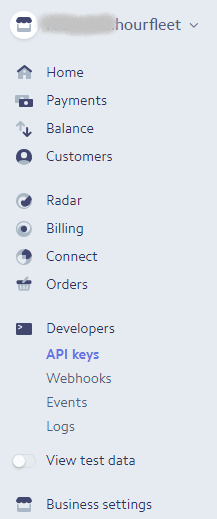
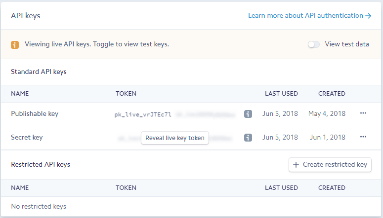

# Integrations
Hourfleet depends on one mandatory integration ([Stripe](http://stripe.com)), and support a number of optional integrations. 

## Stripe (Mandatory)
If you don't alread have a Stripe account you'll need to [register](https://dashboard.stripe.com/register). If you need to do this, we recommend you take some time [to learn about Stripe](https://stripe.com/customers). 

The next step is to configure your Hourfleet tenancy with your Stripe API keys. This enables your Hourfleet tenancy to bill your customers when they use your car sharing service.

From your Stripe Dashboard, click `Developers` and then `API Keys`. 

On the right you'll then see a panel which contains two API keys  

Save the `Publishable key`. Then click `Reveal live key token` and the `Secret key` will be displayed. It's secret for a reason - don't leave this lying around!

Send both keys to `admin@mindkin.co.nz` and then delete any reference to these keys from your computer. Remember to check your email's Sent Items too.

Once we receive these keys we will configure your tenancy, and the Stripe setup will be complete.

**Important**: Your relationship with Stripe is governed by your acceptance of their Terms of Service. We are unable to manage any aspect of your relationship with Stripe, or to advocate for you. Other than initiating charges to your cstomers as covered by our Terms of Service, we are unable to act for or on your behalf.

## Zapier

You can now create a 'Zap' at [zapier](http://www.zapier.com) to connect your car sharing network with your favourite apps, like : Intercom, Slack, and Email. See [Zapier Integration](zapier.html) for details.
