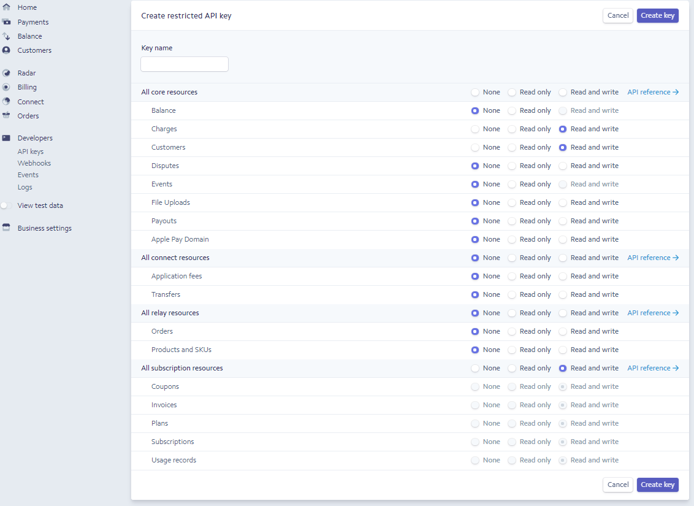

## Integrations
Hourfleet depends on one mandatory third-party integration ([Stripe](http://stripe.com)), and supports a number of optional third-party integrations. In all cases, configuring this integration requires you to 
1. Sign in to your account with the integraton provider
1. Create Restricted API keys - one Publishable and the other Secret  
1. Send those API keys to `admin@mindkin.co.nz` and then delete any reference to these keys from your computer. Remember to check your email's Sent Items too.

### Stripe
You will need a Stripe account to operate an Hourfleet Tenancy. If you don't alread have a Stripe account you'll need to [register](https://dashboard.stripe.com/register). If you need to do this, we recommend you take some time [to learn about Stripe](https://stripe.com/customers). 

The next step is to configure your Hourfleet tenancy with your Stripe API keys. This enables your Hourfleet tenancy to bill your customers when they use your car sharing service.

From your Stripe Dashboard, click `Developers`, then `API Keys`, and then `+ Create restricted key`

  

Give the key the name `Hourfleet`. All your permissions should be showing `None`. Go through and check each  of the permissions shown as needing `Read and write` as shown below.

 
  
Now click `Create key`

  

Now it's time to colect the two keys that Hourfleet needs. First save the `Publishable key`. Then in the Restricted API key panel by Hourfleet, click `Reveal live key token` and the `Secret key` will be displayed. It's secret for a reason - don't leave this lying around!

Email the `Publishable key` and `Secret key` to `admin@mindkin.co.nz`. If applicable delete this email from your Sent Items folder.

**Important**: Your relationship with Stripe is governed by your acceptance of their Terms of Service. We are unable to manage any aspect of your relationship with Stripe, or to advocate for you. Other than initiating charges to your customers as covered by our Terms of Service, we are unable to act for or on your behalf.

### Zapier (Optional)

You can now create a 'Zap' at [zapier](http://www.zapier.com) to connect your car sharing network with your favourite apps, like : Intercom, Slack, and Email. See [Zapier Integration](zapier.html) for details.

### LiveChat using Freshdesk.com (Optional)

Once you have signed up and selected a plan that includes LiveChat, you will need to provide your: 'ApiKey' and 'Settings', which can be obtained from the 'Admin' console of your Freshdesk subscription.

* Login to your Freshdesk site: https://yourname.freshdesk.com
* Click on the 'LiveChat' icon

* Make sure Live Chat is 'enabled'
* Make sure your app is enabled.
* Click on the 'Edit' button to the right of your app
* Click on the 'Widget Code' tab
* In the javascript they provide, you need to find and extract the value of the URL that looks like this: 'https://xxxxxxxxxxx.cloudfront.net'. The xxxxxxxx part is your 'ApiKey'
* Now, find the value of the 'window.livechat_setting='xxxxxxxxxxxxxxxxxxxxxxxxx....'. The large blob of text between the quotations marks is the value of your 'Settings' (not including the quotation marks).

### LiveChat using Intercom.com (Optional)

Once you have signed up and selected a plan that includes Intercom 'Acquire', you need to provide your 'ApiKey', which can be obtained form the 'App Settings' console of your Intercom subscription.

* Login to Intercom at: https://app.intercom.io
* Click on your avatar (bottom left-hand corner of page) and click 'App Settings'

* Click on the 'API Keys' menu (to the left)
* The 'APP ID" is the value of your 'ApiKey'

### Google Analytics (Optional)

If you wish to track site usage using Google Analytics, you can do that by providing your 'Tracking Id' found in the 'Administration -> Property Settings' page of your Google Analytics configuration page, for your Google account.

> Note: Hourfleet will include the standard javascript that [Google Analytics instructs](https://developers.google.com/analytics/devguides/collection/analyticsjs/) to add to every web page, configured with your 'Tracking Id'.

