### Table of Contents
- [Email Configuration](#email-configuration)
- [Accounts](#accounts)
  - [Invitation](#invitation-user)
  - [Account Created](#account-created-user)
  - [Attempted Password Reset](#attempted-password-reset-user)
  - [Password Reset Request](#password-reset-request-user)
  - [Password Reset](#password-reset-user)
- [Verifications](#verifications)
  - [Verified Borrower](#verified-borrower-user)
  - [Verified Car Owner](#verified-car-owner-user)
  - [Unverified Borrower](#unverified-borrower-user)
  - [Unverified Car Owner](#unverified-car-owner-user)
  - [Updated Email](#updated-email-user)
  - [Expiring Drivers License](#expiring-drivers-license-user)
- [Booking Requests](#booking-requests)
  - [Draft Requests](#draft-request-borrower)
  - [Pending Requests](#pending-request-borrower)
  - [Cancelled Requests](#cancelled-request-borrower)
  - [Declined Requests](#declined-request-borrower)
  - [Expired Requests](#expired-request-borrower)
- ['Book Later' Bookings](#book-later-bookings)
  - [Approved Requests](#approved-request-borrower)
  - [Cancelled Bookings](#cancelled-booking-borrower)
  - [Due to Begin Bookings](#due-to-begin-booking-borrower)
  - [Booking Begun](#booking-begun-borrower)
  - [Returned Bookings](#booking-returned-borrower)
  - [Completed Bookings](#booking-completed-borrower)
  - [Bookings Due to End](#booking-due-to-end-borrower)
  - [Extended Bookings](#booking-extended-borrower)

----

# Notifications

For key events in Hourfleet, users will receive SMS and Email notifications. For example when they join your network, or when they book a car.
Here you can see an example of all the SMS and Email notifications that get sent and at which key events they happen.
If you would like to be notified of these events at the same time as your customers you can do this through Zapier Integration. To find out how to do this visit the [Zapier Integration](zapier.html) page. 

## Email Configuration

Some email elements are determined by your [Network Operator configuration file](configure.html) and will be the same across all the email notifications that are sent. In the image examples below references to 'Roam' by name, URLs or images will be replaced with your network counterpart.

**Email Headers**

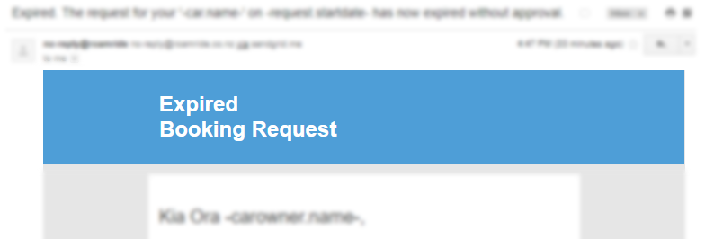

The colour of your email header is determined by the `primary color` attribute in the branding section of your configuration file and is used across all emails.

The content in your email headers are separated onto two lines and is configured per email based on the context in which it is being sent.

**Email Footers**

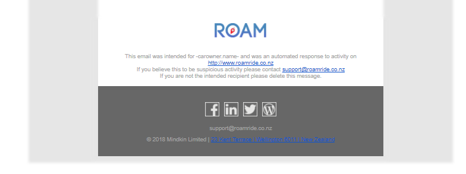

The configuration of your email footer is determined by values in your configuration file and is used across all emails.

- The *Roam* logo is replaced with the image provided for `DesktopImageUrl`
- The activity URL is replaced with the URL provided for `HomeUrl`
- The support URL is replaced with the URL provided for `Email` under the `Support/Company` section
- The social media icons link to the URL's provided under the `social` category. 
  **Note:** If you do not provide a URL for a particular platform, e.g. Twitter, the corresponding icon will not be displayed.
- The address is replaced with the `Address` section provided under the `Support/Company` section
  ​      
## Accounts

----
### Invitation (User)
###### ID: 4000 

This notification is sent to the *User* when they request an invitation to create an account on your network.

Substitutions Available:

`invitation.fullname`
`invitation.firstname`
`invitation.lastname`
`invitation.url`

**Email**

**SMS**

> We've made it super easy for you to join (Your Network Name). Register at: %user.url% 

### Account Created (User) 
###### ID: 4002 

This notification is sent to the *User* when they created an account on your network.

Substitutions Available:

`user.fullname`
`user.firstname`
`user.lastname`
`user.url`

**Email**

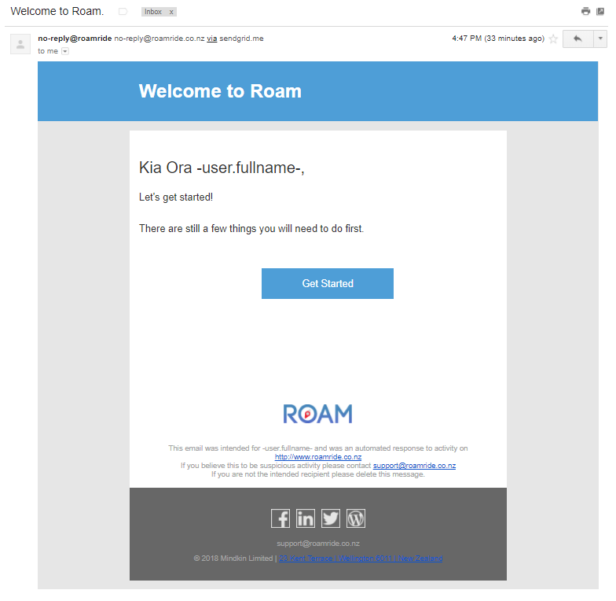

**SMS**

> Welcome to (Your Network Name). Please get verified at: %user.url%

### Attempted Password Reset (User)
###### ID: 4010 

This notification is sent to the *Email Address* used when a *User* requests a password reset on an email address that is _NOT_ registered on your network. 

This email is sent as a courtesy to the email recipient, even though they have no account in your network. It is to alert them to the fact that someone (most likely an attacker) is trying to reset their password on your network. A common attack is to obtain an email address and password from a weakly protected site, and then try to find other sites where that password is used, and attempt a password reset to compromise that site. This email is simply notifying the email recipient of that possibility, which occasionally serves to attract new customers to your network because of the social service you have provided them.

There is no assocaited SMS for this email. 

Substitutions Available:

`email`

**Email**

**SMS**

> Account Access Attempted. Your number was used to change the password of an (Your Network Name) account.

### Password Reset Request (User)
###### ID: 4011 

This notification is sent to the *Email Address* used when a *User* requests a password reset on an email address that is registered on your network.

Substitutions Available:

`email`
`url`

**Email**

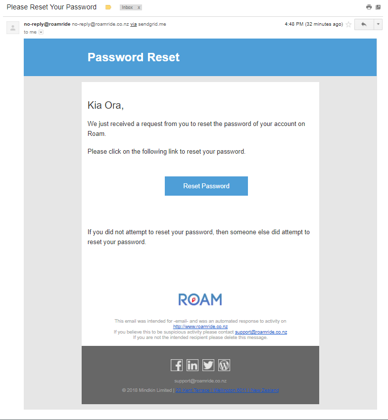

**SMS**

> Please click on this link to reset your password: %url%

### Password Reset (User)
###### ID: 4012 

This notification is sent to the *User* when they successfully reset their account password.

Substitutions Available:

`email`

**Email**

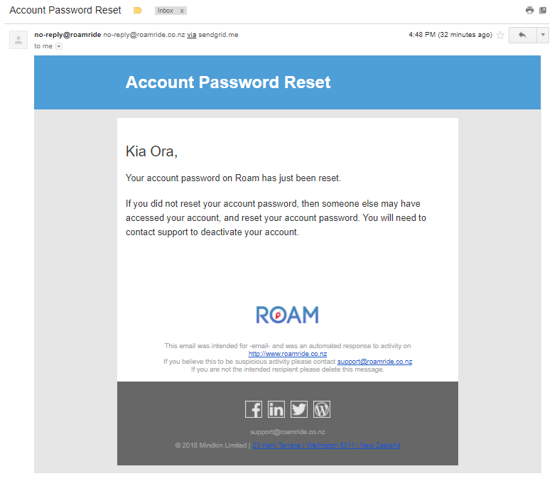

**SMS**

> Your account password has just been reset.

## Verifications

----
### Verified Borrower (User)
###### ID: 302 

This notification is sent to the *User* when they have been verified for all the requirements needed to borrow a car on your network.

Substitutions Available:

`user.name`
`user.firstname`
`user.lastname`

**Email**

**SMS**

> You have just been fully verified as a borrower, you are all set to borrow any car now.

### Verified Car Owner (User)
###### ID: 304
This notification is sent to the *User* when they have been verified for all the requirements needed to list a car on your network.

Substitutions Available:

`user.name`
`user.firstname`
`user.lastname`

**Email**

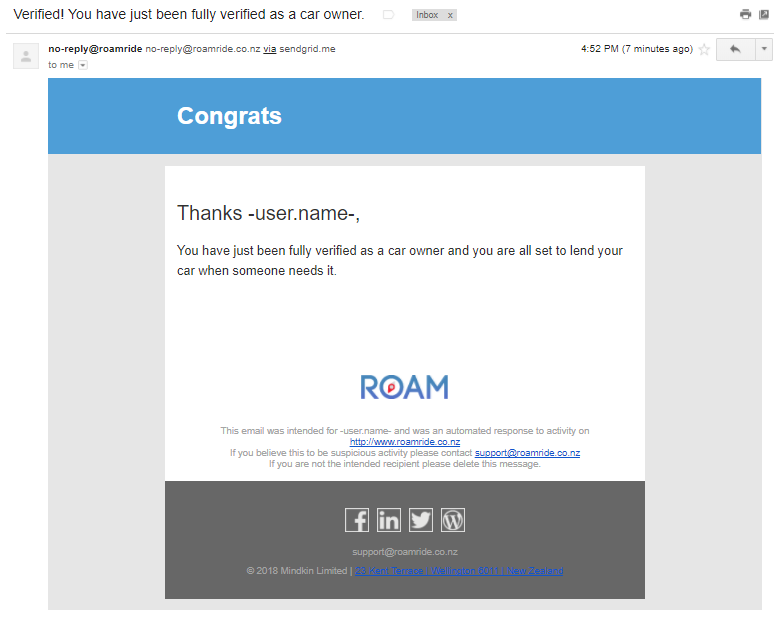

**SMS**

> You have just been fully verified as a car owner and you are all set to lend your car when someone needs it.

### Unverified Borrower (User)
###### ID: 303
This notification is sent to the *User* when they have become unverified for any of the requirements needed to borrow a car on your network.

Substitutions Available:

`user.name`
`user.firstname`
`user.lastname`

**Email**

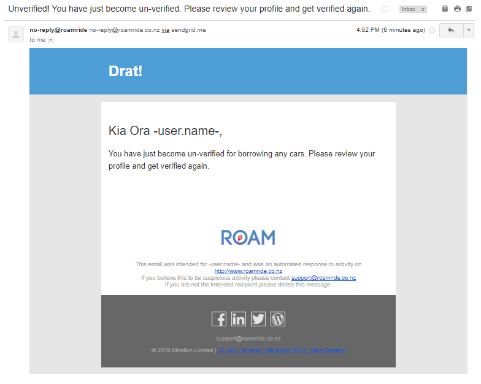

**SMS**

> You have just become unverified for borrowing any cars. Please review your profile and get verified again.

### Unverified Car Owner (User)
###### ID: 305
This notification is sent to the *User* when they have become unverified for any of the requirements needed to list a car on your network.

Substitutions Available:

`user.name`
`user.firstname`
`user.lastname`
`verifications.url`

**Email**

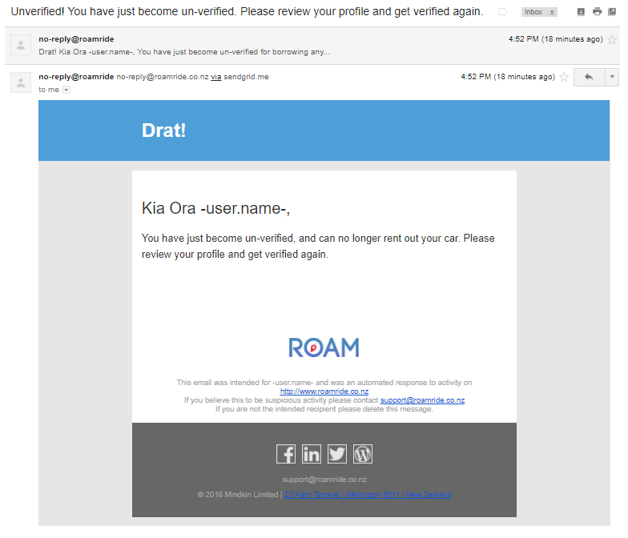

**SMS**

> You have just become un-verified, and can no longer rent out your car. Please review your profile and get verified again.

### Updated Email (User)
###### ID: 306
This notification is sent to the *User* when they have changed their account email address.

Substitutions Available:

`user.name`
`user.firstname`
`user.lastname`
`verifications.url`

**Email**

**SMS**

> Please verify your email address: %verification.url%

### Expiring Drivers License (User)
###### ID: 307
This notification is sent to the *User* when their listed drivers license is about to expire (1 month before expiry date).

Substitutions Available:

`user.name`
`user.firstname`
`user.lastname`

**Email**

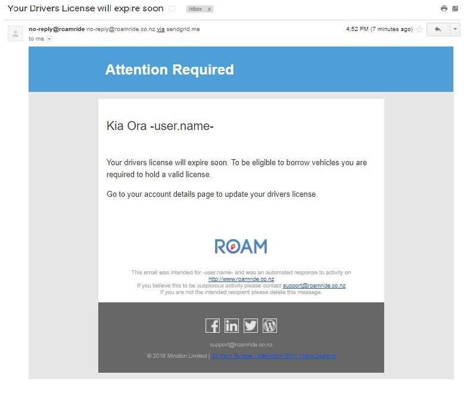

**SMS**

> Your drivers license will expire soon. Please review your profile and update your drivers license.

## Booking Requests

----
Substitutions Available:

`borrower.name`
`borrower.firstname`
`borrower.lastname`
`carowner.name`
`carowner.firstname`
`carowner.lastname`
`car.plate`
`car.name`
`car.photo`
`car.url`
`request.startdate`
`request.enddate`
`request.cancelleddate`
`request.cost.estimated`
`request.url`
`requests.url`

### Draft Request (Borrower)
###### ID: 101
This notification is sent when a borrower makes a booking request and is not fully verified.

**Email**

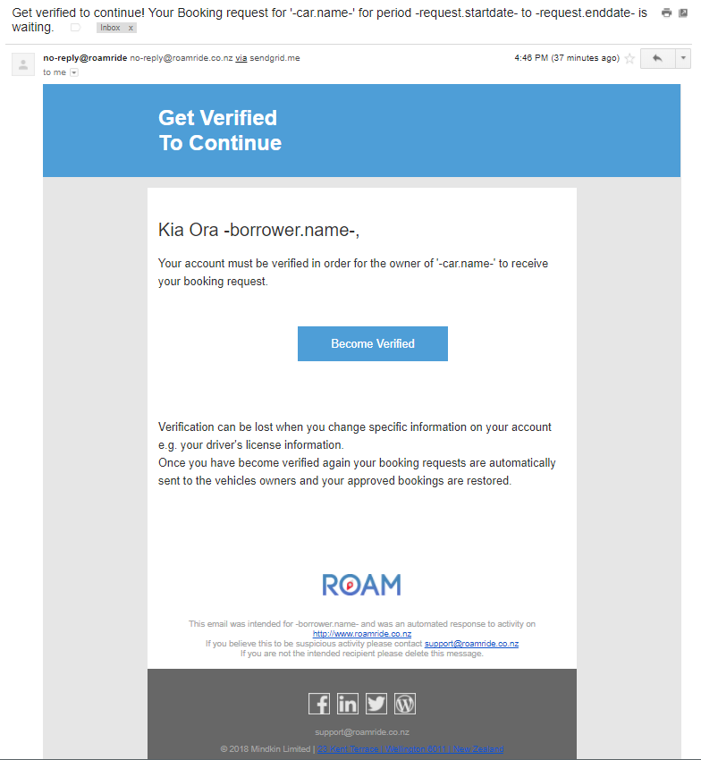

**SMS**

>  Get verified to continue. Your booking of '%car.name%' is waiting. See %request.url%

### Pending Request (Borrower)
###### ID: 104
This notification is sent to the *Borrower* when a booking request is pending.

**Email**

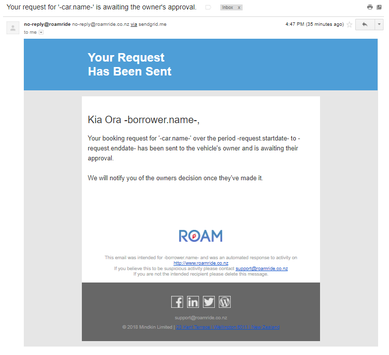

**SMS**

>  Your request for '%car.name%' at %request.startdate% is awaiting the owner's approval. See %request.url%

### Pending Request (Car Owner)
###### ID: 105
This notification is sent to the *Car Owner* when a booking request is pending.

**Email**

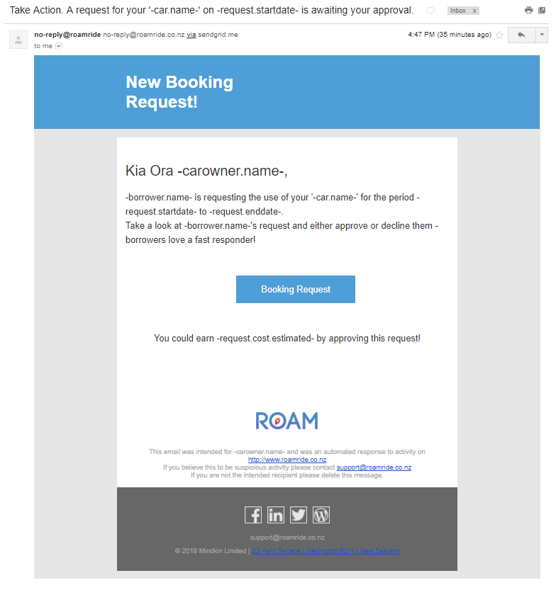

**SMS**

>  A request for your '%car.name%' by %borrower.name% at %request.startdate% is awaiting your approval. See %request.url%

### Cancelled Request (Borrower)
###### ID: 102
This notification is sent to the *Borrower* when they cancel a booking request.

**Email**

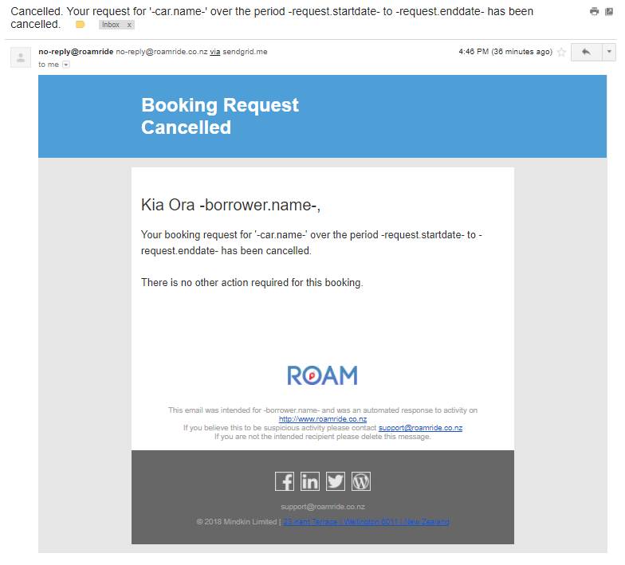

**SMS**
> Your request for '%car.name%' at %request.startdate% has been cancelled. See %request.url%

### Cancelled Request (Car Owner)
###### ID: 103
This notification is sent to the *Car Owner* when a *Borrower* cancels a booking request.

**Email**

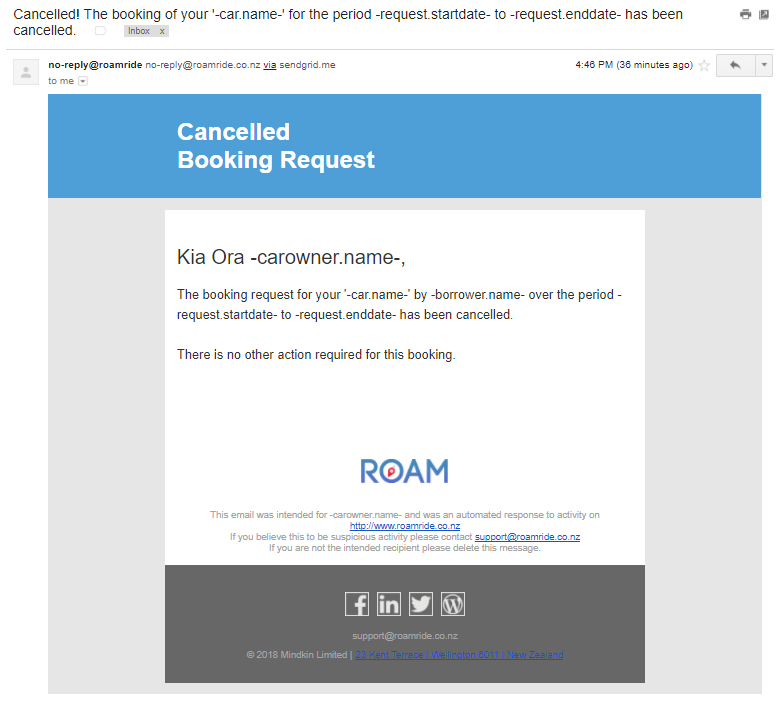

**SMS**
> A request for your '%car.name%' by %borrower.name% at %request.startdate% has been cancelled. See %request.url%

### Declined Request (Borrower)
###### ID: 106
This notification is sent to the *Borrower* when their booking request has been declined.

**Email**

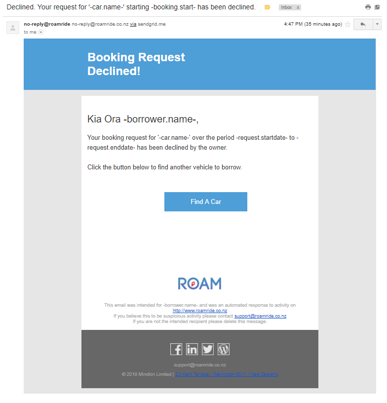

**SMS**
> Your request for '%car.name%' at %request.startdate% has been declined. See %request.url%

### Declined Request (Car Owner)
###### ID: 107
This notification is sent to the *Car Owner* when they decline a booking request.

**Email**

**SMS**
> The request for your '%car.name%' by %borrower.name% at %request.startdate% has been declined. See %request.url%

### Expired Request (Borrower)
###### ID: 108
This notification is sent to the *Borrower* when their booking request has expired.

**Email**

**SMS**
> Your request for '%car.name%' at %request.startdate% has now expired without any approval. See %request.url%

### Expired Request (Car Owner)
###### ID: 109
This notification is sent to the *Car Owner* when a booking request has expired.

**Email**

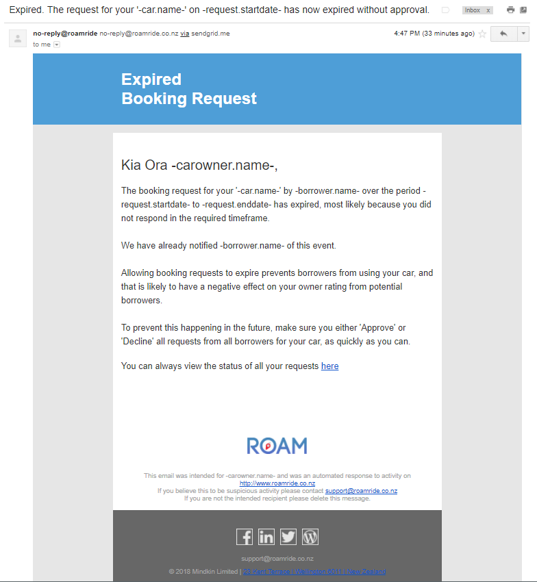

**SMS**
> The request for your '%car.name%' by %borrower.name% at %request.startdate% has now expired. See %request.url%

### Unread Conversation
###### ID: 110

This notification is either send to the *Car Owner* or the *Borrower* when the other party has sent a new message in the conversation for the request.

> Note: this notification only occurs if recipient of the notification has previously read the entire conversation.

Substitutions Available:

The following substitutions replace the respective versions for `borrower` and `carowner` used in other notifications.

`sender.name`
`sender.firstname`
`sender.lastname`
`recipient.name`
`recipient.firstname`
`recipient.lastname`

**Email**

**SMS**
> You have a new message from -sender.name-. See %request.url%

## 'Book Later' Bookings

----
Substitutions Available:

`borrower.name`
`borrower.firstname`
`borrower.lastname`
`carowner.name`
`carowner.firstname`
`carowner.lastname`
`car.plate`
`car.name`
`car.photo`
`car.url`
`car.homelocation.description`
`car.homelocation.address`
`car.currentlocation.address`
`booking.reference`
`booking.startdate`
`booking.enddate`
`booking.cancelleddate`
`booking.returneddate`
`booking.useddate`
`booking.completeddate`
`booking.cost.usage`
`booking.cost.estimated`
`booking.url`
`bookings.url`
`booking.comments.borrowercancellation`
`booking.comments.borrowerreturned`
`booking.comments.carownercancellation`
`booking.comments.carownercompletion`

### Approved Request (Borrower)
###### ID: 201
This notification is sent to the *Borrower* when their booking request has been approved and is now a booking.

**Email**

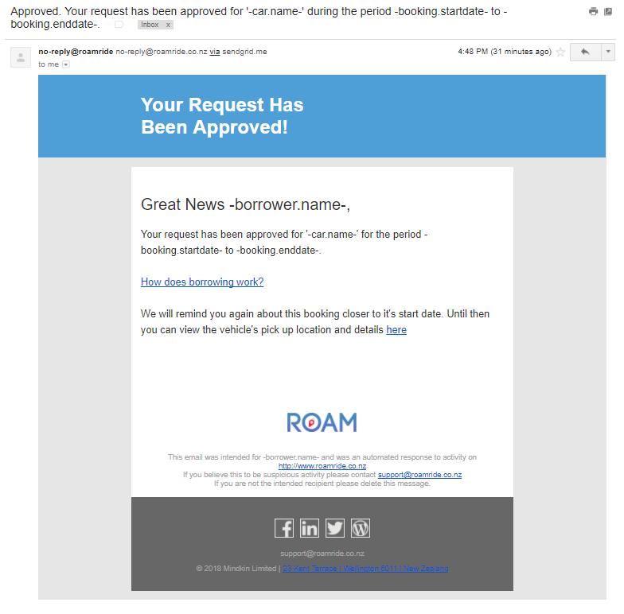

**SMS**
> Your request for '%car.name%' at %booking.startdate% has been approved by the owner. See %booking.url%

### Approved Request (Car Owner)
###### ID: 202
This notification is sent to the *Car Owner* when they approve a booking request and is now a booking.

**Email**

**SMS**
> You have approved the request for your '%car.name%' by %borrower.name% at %booking.startdate%. See %booking.url%

### Cancelled Booking (Borrower)
###### ID: 203
This notification is sent to the *Car Owner* when a booking has been cancelled.

**Email**

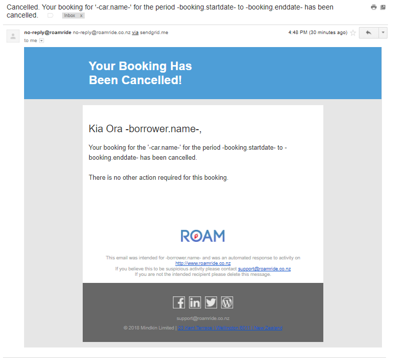

**SMS**
> Your booking for '%car.name%' at %booking.startdate% has been cancelled. See %booking.url%

### Cancelled Booking (Car Owner)
###### ID: 204
This notification is sent to the *Car Owner* when a booking has been cancelled.

**Email**
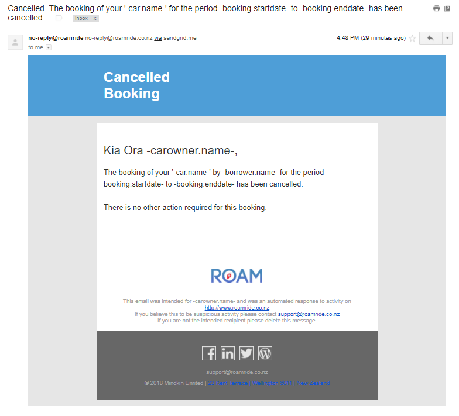

**SMS**
> The booking for your '%car.name%' by %borrower.name% at %booking.startdate% has been cancelled. See %booking.url%

### Due to Begin Booking (Borrower)
###### ID: 211
This notification is sent to the *Borrower* about their upcoming booking.

**Email**

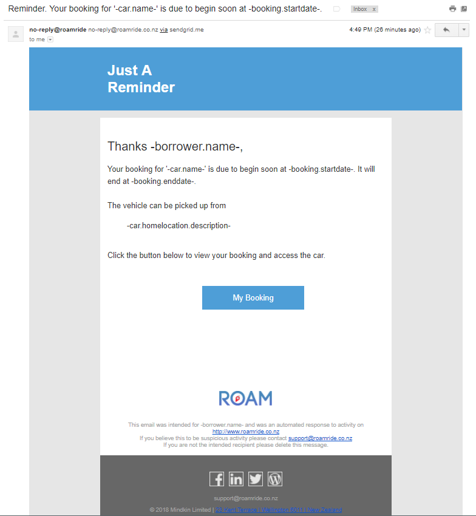

**SMS**
> Your booking for '%car.name%' at %booking.startdate% is due to begin soon. See %booking.url%

### Due to Begin Booking (Car Owner)
###### ID: 212
This notification is sent to the *Car Owner* about the upcoming booking of their vehicle.

**Email**
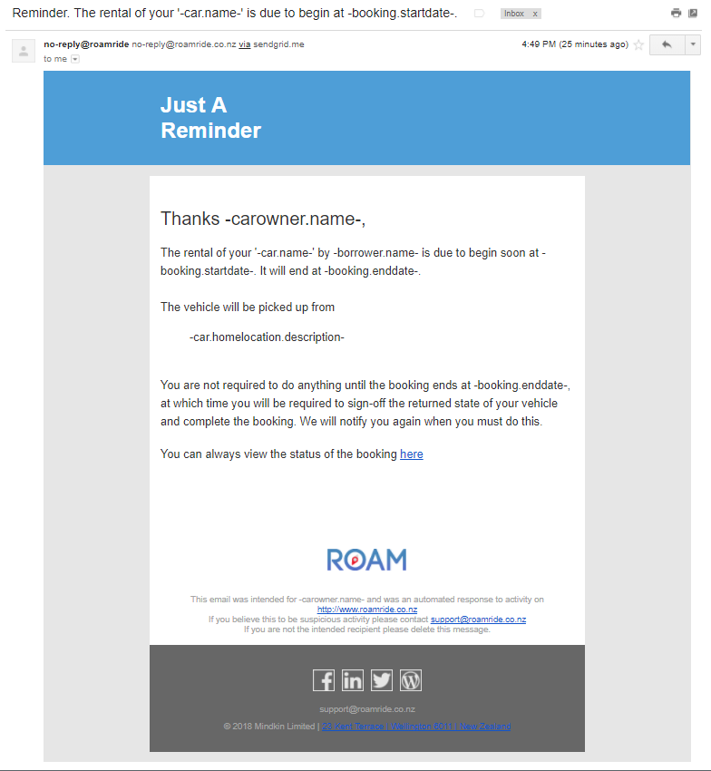

**SMS**
> The rental of your '%car.name%' by %borrower.name% at %booking.startdate% is due to begin soon. See %booking.url%

### Booking Begun (Borrower)
###### ID: 205
This notification is sent to the *Borrower* once their booking has been started.

**Email**

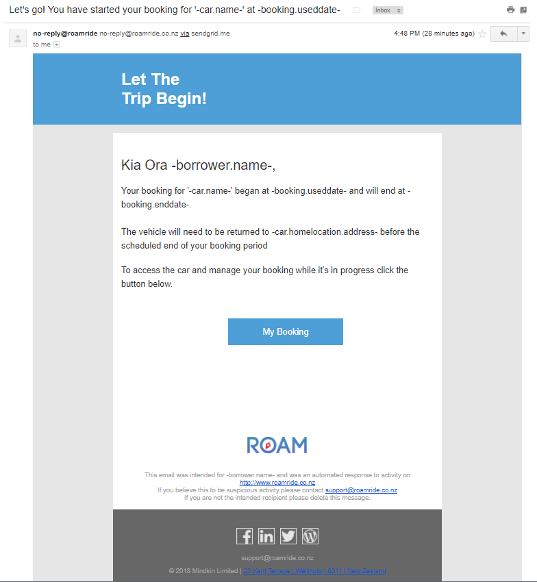

**SMS**
> Lets go!, you have started the rental of '%car.name%' at %booking.useddate%. See %booking.url%

### Booking Begun (Car Owner)
###### ID: 206
This notification is sent to the *Car Owner* when the *Borrower* has started their booking.

**Email**
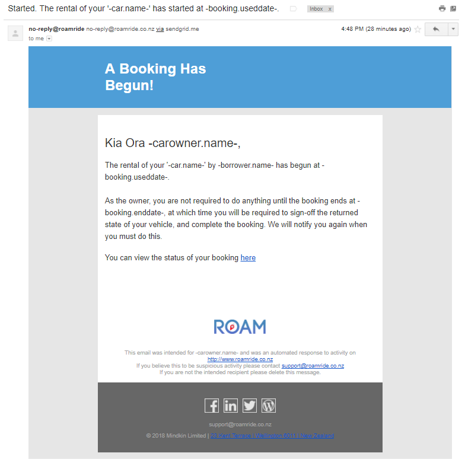

**SMS**
> The rental of your '%car.name%' by %borrower.name% has started at %booking.useddate%. See %booking.url%

### Booking Returned (Borrower)
###### ID: 207
This notification is sent to the *Borrower* when they have returned the vehicle and finished their booking.

**Email**
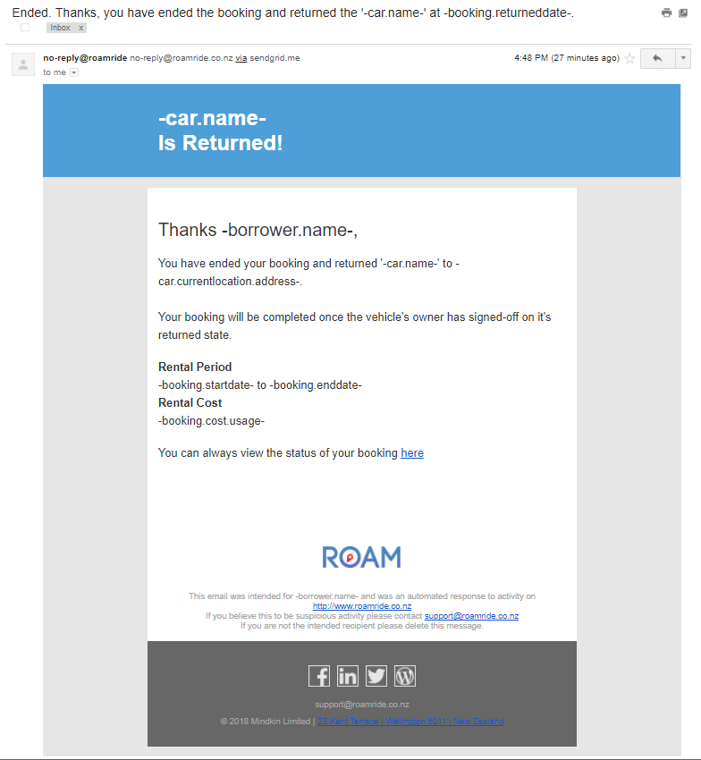

**SMS**
> Thanks, you have ended the rental of the '%car.name%' at %booking.returneddate%. See %booking.url%

### Booking Returned (Car Owner)
###### ID: 208
This notification is sent to the *Car Owner* when the *Borrower* has returned their vehicle and finished their booking.

**Email**
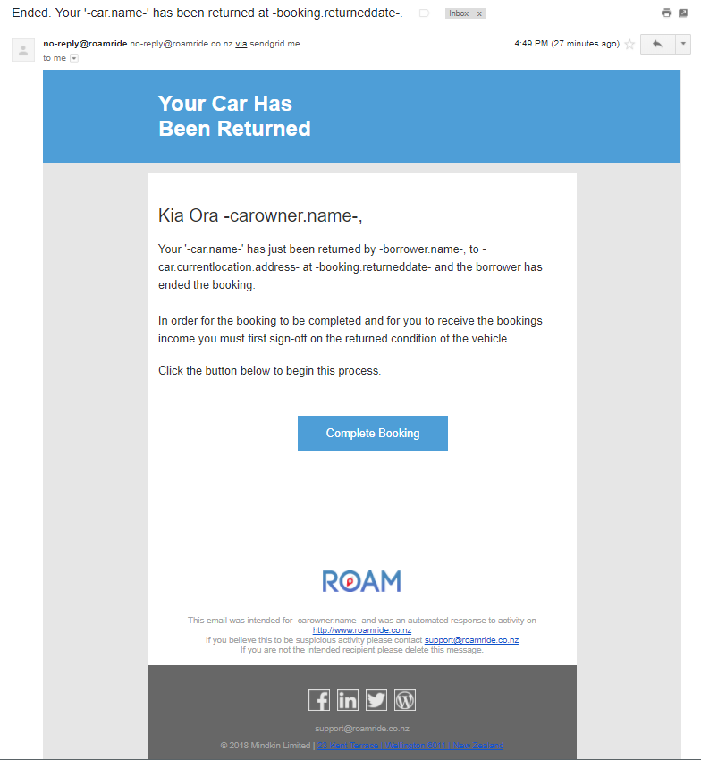

**SMS**
> Your '%car.name%' has been returned by %borrower.name% at %booking.returneddate%. See %booking.url%

### Booking Completed (Borrower)
###### ID: 209
This notification is sent to the *Borrower* when the *Car Owner* completes the booking or Hourfleet auto-completes it.

**Email**

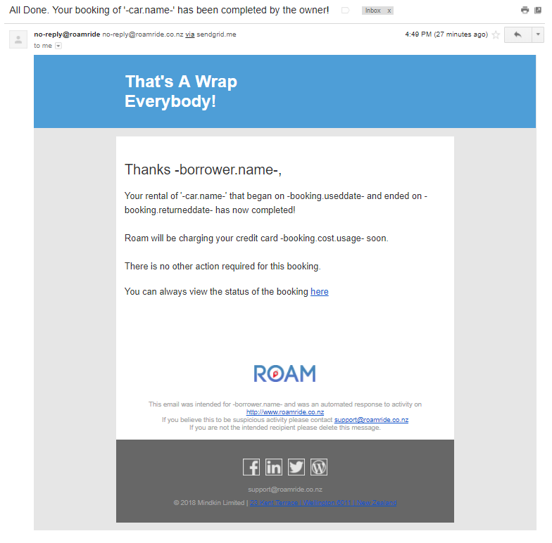

**SMS**
> The rental of '%car.name%' was completed at %booking.completeddate%. See %booking.url%

### Booking Completed (Car Owner)
###### ID: 210
This notification is sent to the *Car Owner* when they complete a booking or Hourfleet has auto-completed one.

**Email**
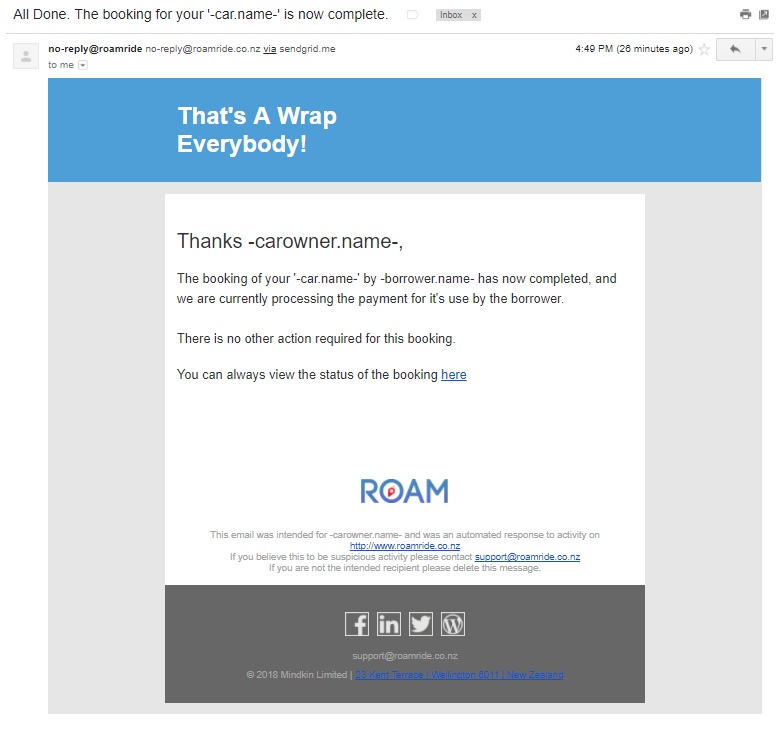

**SMS**

>  The booking of your '%car.name%' by %borrower.name% has now completed

### Booking Due to End (Borrower)
###### ID: 213
This notification is sent to the *Borrower* when their booking is due to end soon.

**Email**
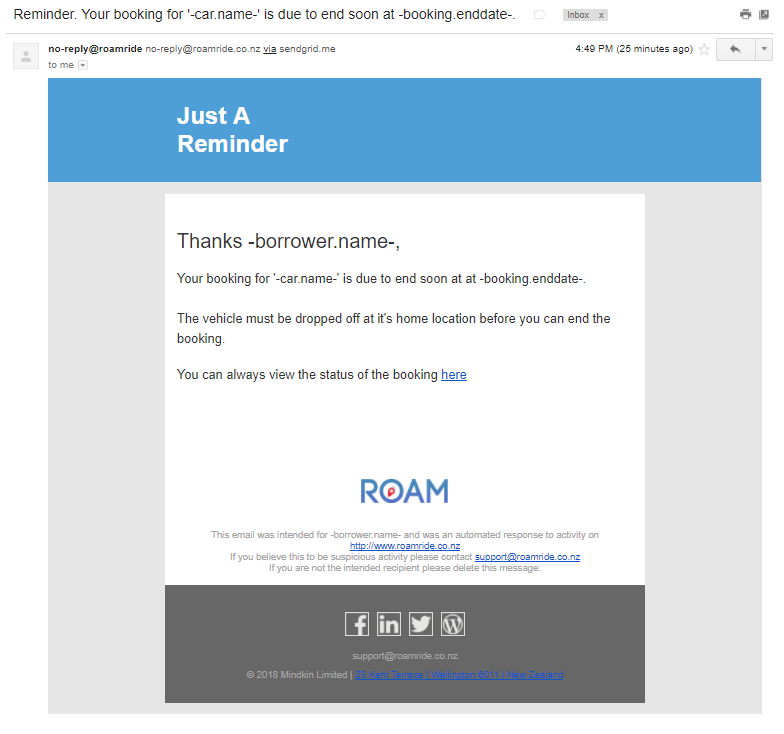

**SMS**

> Your booking for ‘%car.name%’ at %booking.startdate% is due to end soon at %booking.enddate%. See %booking.url%

### Booking Due to End (Car Owner)
###### ID: 214
This notification is sent to the *Car Owner* when the booking of their vehicle is due to end soon.

**Email**
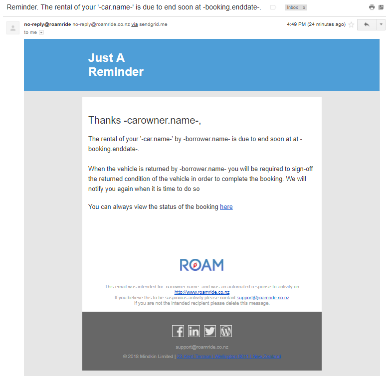

**SMS**

> The rental of your '%car.name%' by %borrower.name% at %booking.startdate% is due to end soon at %booking.enddate%. See %booking.url%

### Booking Extended (Borrower)
###### ID: 215
This notification is sent to the *Borrower* after they have extended their booking period.

**Email**
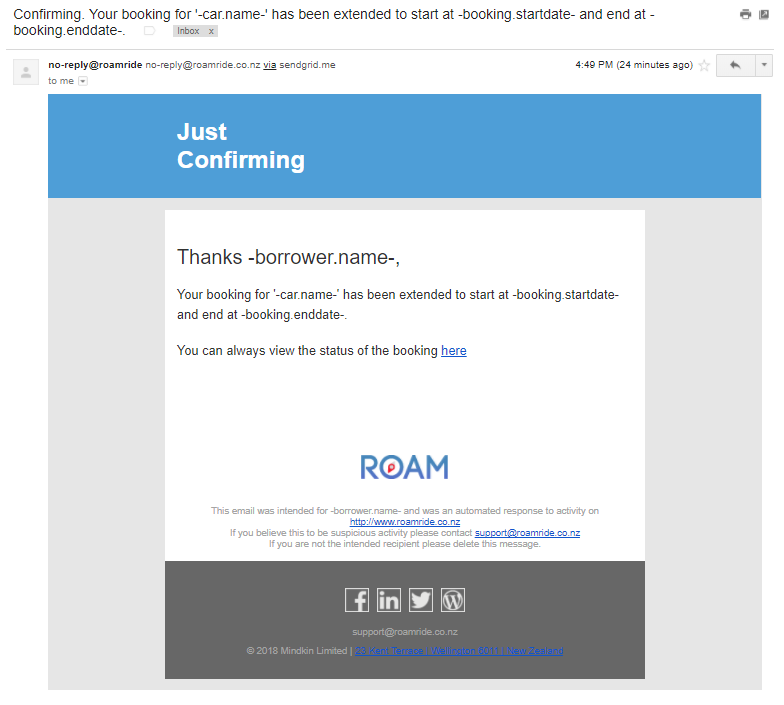

**SMS**

> Your booking for '%car.name%' has been extended to start at %booking.startdate% and end at %booking.enddate%. See %booking.url%

### Booking Extended (Car Owner)
###### ID: 216
This notification is sent to the *Car Owner* after the *Borrower* has extended their booking period.

**Email**

**SMS**
> The rental of your '%car.name%' by %borrower.name% has been extended to start at %booking.startdate% and end at %booking.enddate%. See %booking.url%

### Booking Not returned (Borrower)
###### ID: 217
This notification is sent to the *Borrower* when the *Borrower* has has not returned their booking before the end of the scheduled booking period.

**Email**

**SMS**
> Your booking for '%car.name%' needed to be returned by %booking.enddate%. Please return ASAP. See %booking.url%

### Booking Not returned (Car Owner)
###### ID: 218
This notification is sent to the *Car Owner* when the *Borrower* has has not returned their booking before the end of the scheduled booking period.

**Email**

**SMS**
> The rental of your '%car.name%' by %borrower.name% was not returned on time. See %booking.url%

### Unread Conversation
###### ID: 219
This notification is either send to the *Car Owner* or the *Borrower* when the other party has sent a new message in the conversation for the booking.

> Note: this notification only occurs if recipient of the notification has previously read the entire conversation.

Substitutions Available:

The following substitutions replace the respective versions for `borrower` and `carowner` used in other notifications.

`sender.name`
`sender.firstname`
`sender.lastname`
`recipient.name`
`recipient.firstname`
`recipient.lastname`

**Email**

**SMS**

> You have a new message from -sender.name-. See %booking.url%