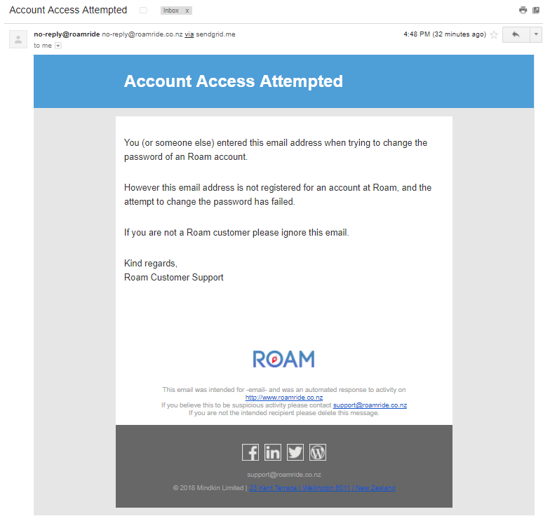
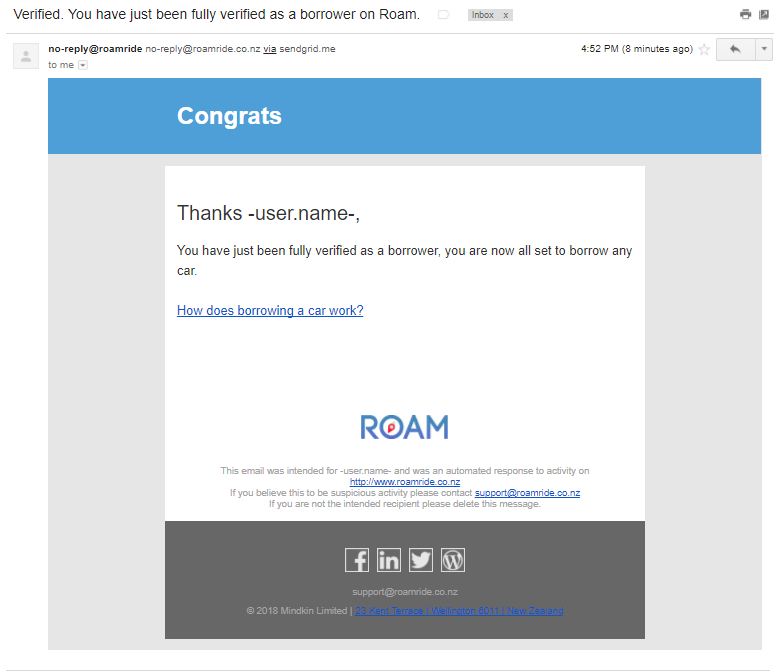

# Notifications

For key events in the system, users will receive SMS and Email notifications. For example when they join your network, or when they book a car.
Here you can see an example of all the SMS and Email notifications that get sent and at which key events they happen.
If you would like to be notified of these events at the same time as your customers you can do this through Zapier Integration. To find out how to do this visit the [Zapier Integration](zapier.html) page.

> Block Quote

## Accounts
----
### Invitation (User)

This notification is sent to the *User* when they request an invitation to create an account on your network.

Substitutions Available:

`invitation.fullname`
`invitation.url`

**Email**

**SMS**
> We've made it super easy for you to join (Your Network Name). Register at: %user.url%

### Account Created (User)

This notification is sent to the *User* when they created an account on your network.

Substitutions Available:

`user.fullname`
`user.url`

**Email**

**SMS**
> Welcome to (Your Network Name). Please get verified at: %user.url%

### Attempted Password Reset (User)

This notification is sent to the *Email Address* used when a *User* requests a password reset on an email address that is not registered on your network.

Substitutions Available:

`email`

**Email**

**SMS**
> Account Access Attempted. Your number was used to change the password of an (Your Network Name) account.

### Password Reset Request (User)

This notification is sent to the *Email Address* used when a *User* requests a password reset on an email address that is registered on your network.

Substitutions Available:

`email`
`url`

**Email**

**SMS**
> Please click on this link to reset your password: %url%

### Password Reset (User)

This notification is sent to the *User* when they successfully reset their account password.

Substitutions Available:

`email`

**Email**

**SMS**
> Your account password has just been reset.

## Verifications
----
### Verified Borrower (User)

This notification is sent to the *User* when they have been verified for all the requirements needed to borrow a car on your network.

Substitutions Available:

`user`

**Email**

**SMS**
> You have just been fully verified as a borrower, you are all set to borrow any car now.

### Verified Car Owner (User)

This notification is sent to the *User* when they have been verified for all the requirements needed to list a car on your network.

Substitutions Available:

`user`

**Email**

**SMS**
> You have just been fully verified as a car owner and you are all set to lend your car when someone needs it.

### Unverified Borrower (User)

This notification is sent to the *User* when they have become unverified for any of the requirements needed to borrow a car on your network.

Substitutions Available:

`user`

**Email**

**SMS**
> You have just become un-verified for borrowing any cars. Please review your profile and get verified again.

### Unverified Car Owner (User)

This notification is sent to the *User* when they have become unverified for any of the requirements needed to list a car on your network.

Substitutions Available:

`user`

**Email**

**SMS**
> You have just become un-verified, and can no longer rent out your car. Please review your profile and get verified again.

### Updated Email (User)

This notification is sent to the *User* when they have changed their account email address.

Substitutions Available:

`user`

**Email**

**SMS**
> Please verify your email address: %verification.url%

## Booking Requests
----
Substitutions Available:

`borrower.name`
`carowner.name`
`car.plate`
`car.name`
`car.photo`
`car.url`
`request.startdate`
`request.enddate`
`request.cancelleddate`
`request.cost.estimated`
`request.url`
`requests.url`

### Draft Request (Borrower)

This notification is sent when a borrower makes a booking request and is not fully verified.

**Email**

**SMS**
> Get verified to continue. Your booking of '%car.name%' is waiting. See %request.url%

### Pending Request (Borrower)

This notification is sent to the *Borrower* when a booking request is pending.

**Email**

**SMS**
> Your request for '%car.name%' at %request.startdate% is awaiting the owner's approval. See %request.url%

### Pending Request (Car Owner)

This notification is sent to the *Car Owner* when a booking request is pending.

**Email**

**SMS**
> A request for your '%car.name%' by %borrower.name% at %request.startdate% is awaiting your approval. See %request.url%

### Cancelled Request (Borrower)

This notification is sent to the *Borrower* when they cancel a booking request.

**Email**

**SMS**
> Your request for '%car.name%' at %request.startdate% has been cancelled. See %request.url%

### Cancelled Request (Car Owner)

This notification is sent to the *Car Owner* when a *Borrower* cancels a booking request.

**Email**

**SMS**
> A request for your '%car.name%' by %borrower.name% at %request.startdate% has been cancelled. See %request.url%

### Declined Request (Borrower)

This notification is sent to the *Borrower* when their booking request has been declined.

**Email**

**SMS**
> Your request for '%car.name%' at %request.startdate% has been declined. See %request.url%

### Declined Request (Car Owner)

This notification is sent to the *Car Owner* when they decline a booking request.

**Email**

**SMS**
> The request for your '%car.name%' by %borrower.name% at %request.startdate% has been declined. See %request.url%

### Expired Request (Borrower)

This notification is sent to the *Borrower* when their booking request has expired.

**Email**

**SMS**
> Your request for '%car.name%' at %request.startdate% has now expired without any approval. See %request.url%

### Expired Request (Car Owner)

This notification is sent to the *Car Owner* when a booking request has expired.

**Email**

**SMS**
> The request for your '%car.name%' by %borrower.name% at %request.startdate% has now expired. See %request.url%

## 'Book Later' Bookings
----
Substitutions Available:

`borrower.name`
`carowner.name`
`car.plate`
`car.name`
`car.photo`
`car.url`
`car.homelocation.description`
`car.homelocation.address`
`car.currentlocation.address`
`booking.startdate`
`booking.enddate`
`booking.cancelleddate`
`booking.returneddate`
`booking.useddate`
`booking.completeddate`
`booking.cost.usage`
`booking.cost.estimated`
`booking.url`
`bookings.url`
`booking.comments.borrowercancellation`
`booking.comments.borrowerreturned`
`booking.comments.carownercancellation`
`booking.comments.carownercompletion`

### Approved Request (Borrower)

This notification is sent to the *Borrower* when their booking request has been approved and is now a booking.

**Email**

**SMS**
> Your request for '%car.name%' at %booking.startdate% has been approved by the owner. See %booking.url%

### Approved Request (Car Owner)

This notification is sent to the *Car Owner* when they approve a booking request and is now a booking.

**Email**

**SMS**
> You have approved the request for your '%car.name%' by %borrower.name% at %booking.startdate%. See %booking.url%

### Cancelled Booking (Borrower)

This notification is sent to the *Car Owner* when a booking has been cancelled.

**Email**

**SMS**
> Your booking for '%car.name%' at %booking.startdate% has been cancelled. See %booking.url%

### Cancelled Booking (Car Owner)

This notification is sent to the *Car Owner* when a booking has been cancelled.

**Email**

**SMS**
> The booking for your '%car.name%' by %borrower.name% at %booking.startdate% has been cancelled. See %booking.url%

### Due to Begin Booking (Borrower)

This notification is sent to the *Borrower* about their upcoming booking.

**Email**

**SMS**
> Your booking for '%car.name%' at %booking.startdate% is due to begin soon. See %booking.url%

### Due to Begin Booking (Car Owner)

This notification is sent to the *Car Owner* about the upcoming booking of their vehicle.

**Email**

**SMS**
> The rental of your '%car.name%' by %borrower.name% at %booking.startdate% is due to begin soon. See %booking.url%

### Booking Begun (Borrower)

This notification is sent to the *Borrower* once their booking has been started.

**Email**

**SMS**
> Lets go!, you have started the rental of '%car.name%' at %booking.useddate%. See %booking.url%

### Booking Begun (Car Owner)

This notification is sent to the *Car Owner* when the *Borrower* has started their booking.

**Email**

**SMS**
> The rental of your '%car.name%' by %borrower.name% has started at %booking.useddate%. See %booking.url%

### Booking Returned (Borrower)

This notification is sent to the *Borrower* when they have returned the vehicle and finished their booking.

**Email**

**SMS**
> Thanks, you have ended the rental of the '%car.name%' at %booking.returneddate%. See %booking.url%

### Booking Returned (Car Owner)

This notification is sent to the *Car Owner* when the *Borrower* has returned their vehicle and finished their booking.

**Email**

**SMS**
> Your '%car.name%' has been returned by %borrower.name% at %booking.returneddate%. See %booking.url%

### Booking Completed (Borrower)

This notification is sent to the *Borrower* when the *Car Owner* completes the booking or the system auto-completes it.

**Email**

**SMS**
> The rental of '%car.name%' was completed at %booking.completeddate%. See %booking.url%

### Booking Completed (Car Owner)

This notification is sent to the *Car Owner* when they complete a booking or the system has auto-completed one.

**Email**

**SMS**
> The booking of your '%car.name%' by %borrower.name% has now completed

### Booking Due to End (Borrower)

This notification is sent to the *Borrower* when their booking is due to end soon.

**Email**

**SMS**
> Your booking for '%car.name%' at %booking.startdate% is due to end soon at %booking.enddate%. See %booking.url%

### Booking Due to End (Car Owner)

This notification is sent to the *Car Owner* when the booking of their vehicle is due to end soon.

**Email**

**SMS**
> The rental of your '%car.name%' by %borrower.name% at %booking.startdate% is due to end soon at %booking.enddate%. See %booking.url%

### Booking Extended (Borrower)

This notification is sent to the *Borrower* after they have extended their booking period.

**Email**

**SMS**
> Your booking for '%car.name%' has been extended to start at %booking.startdate% and end at %booking.enddate%. See %booking.url%

### Booking Extended (Car Owner)

This notification is sent to the *Car Owner* after the *Borrower* has extended their booking period.

**Email**

**SMS**
> The rental of your '%car.name%' by %borrower.name% has been extended to start at %booking.startdate% and end at %booking.enddate%. See %booking.url%
