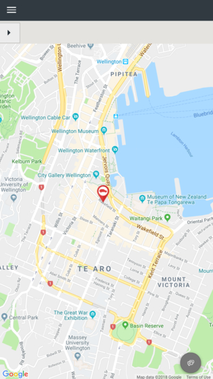
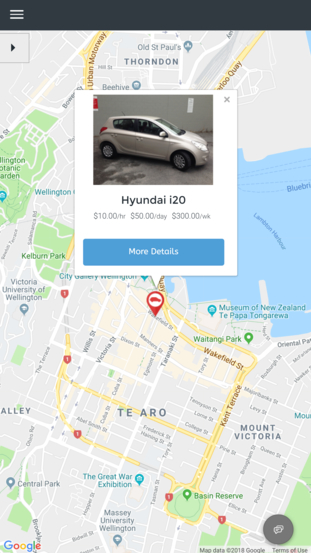
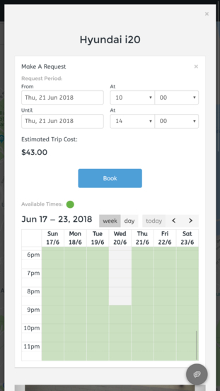
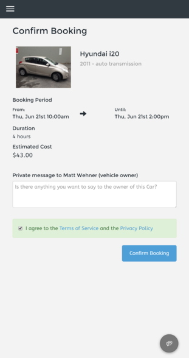
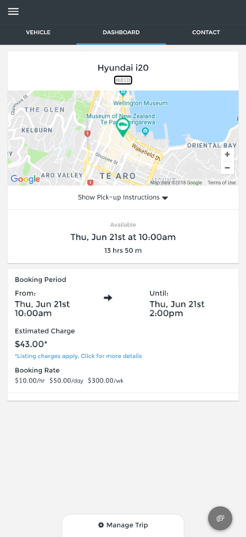
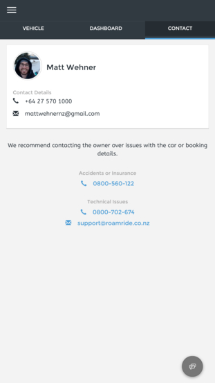
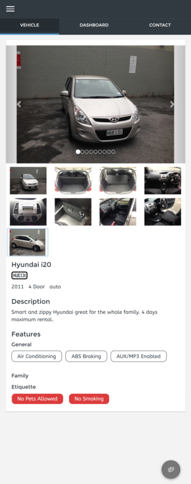
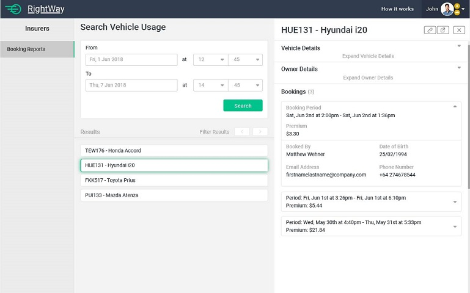

# Screens  

Hourfleet is a full-featured car sharing platform. In practice this means there are a large number of screens and features. This section captures some of the key screens that will exist* in your tenancy

Table of Contents  
- [Finding and booking a car](#finding-and-booking-a-car)
- [Managing a booking](#managing-a-booking)
- [Insurer dashboard](#insurer-dashboard)

# Finding and booking a car 

Cars can be located by entering a location and/or date and time of pickup. Car can also be found by browing the map and clicking on the red pins. Cars that are available have red pins. A borrow can view the car's full details, and make a request. They are required to acceot the Terms of Servive and Privacy Policy each time they make a booking.

|  

|  

# Managing a booking

All bookings are managed from a single dashboard. Once a booking is a configured number of minutes prior to its start, the interface provides a `start` button for the borrower.

|  

|  

# Insurer Dashboard

| Insurer Dashboard ||

> &ast; Hourfleet is under constant revision, and sometime we're a bit behind updateing these images with the latest versions. 
