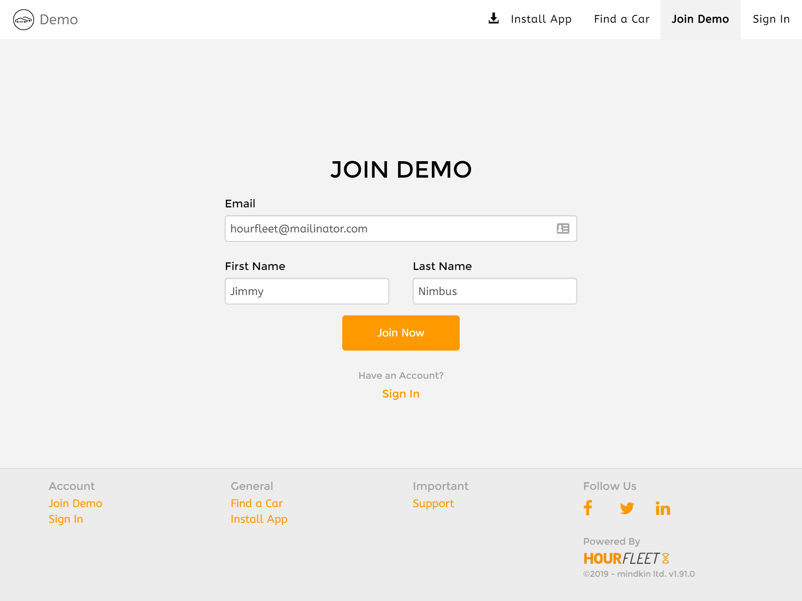
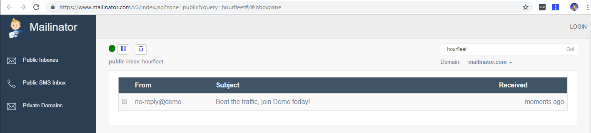
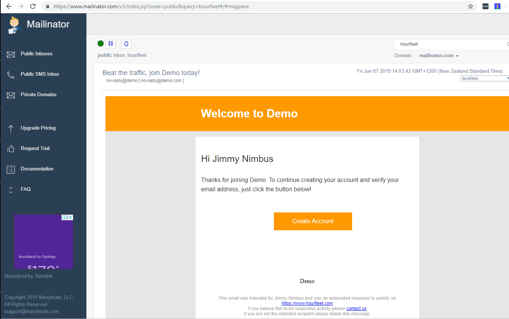
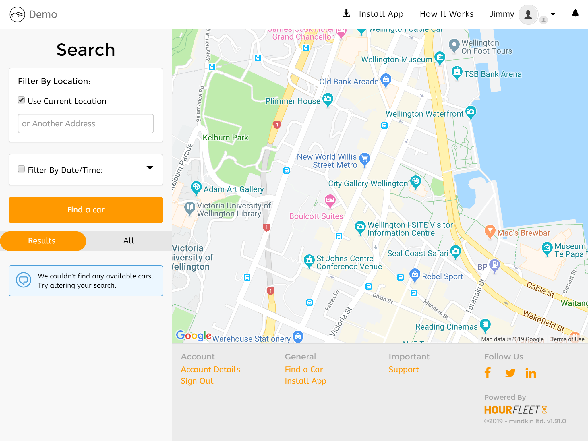

# Lets' try out your new Car Share

You've started your free 14 day free trial, you've created your new Car Share, and you've registered your new account. **What do you do now?**

We recognise that _right now_ it is not so easy to see what the experience looks like for your customers using Hourfleet once you have signed up. We are working on improving that with product videos and tutorials that are coming soon.

For now, this will be our first-steps tutorial, that will walk you through the Hourfleet App. We will create some user accounts, register a new car and even rent out your car in the App.

You should get a good feel for how it all works, and see some of the features that Hourfleet supports for you and your customers. You should get a better understanding  of how things hang together. There is a lot in Hourfleet, so we will try to keep it brief, and leave you to  explore the rest later.

If you are more interested in some of the concepts of how Hourfleet works [click here](howitworks.html), but otherwise its time to get hands-on a see Hourfleet in action.

Here is the **plan** for this walkthrough:

1. You have already been invited to create your operators account in the App, but your customers will need their own accounts. So, we are going to create another account to represent one of your customers, who is going to borrow one of your cars.
2. Then we are going to register a car on your network. Don't worry, it does not have to be a _real_ car just yet. We are going to set it up for borrowing, and you can see some of the things that have to be in place for cars and their owners (you in this case).
3. Once your car is all set up, you are going to switch to acting as one of your customers, and go find and borrow your new car. You will then see how the booking system works and how the App helps guides your customers to finding and borrowing cars.
4. Finally, we are going to take the car offline, since, after this walk through you may or may not want others to book and use your fake car!

> One last note: all the screenshots in this walkthrough are taken from an Apple iPad mobile device. So what you see may be slightly different depending on whether you are on a desktop, tablet or mobile phone device.

OK, let's get started.

## Setting up accounts

By now, after creating your new Car Share, you should have already received an invitation by email to your App, inviting you to join your Car Share.

If you have already been through the below process, **skip this next step**, you have already done it. just sign in to the App.

#### Creating your account

In that first email, there is a giant 'Create Account' button, which if you click, sends you to the 'Create an Account' page below. 

Fill out your name, email and conviction status, declare yourself as not a robot, and create your account, and you will be signed in to your car sharing App.

### Your experience as an operator

>  Note: From here on out, now that you are seeing and using your Hourfleet App, we are just going to call this 'App' for the rest of this walkthrough.

Now, things may look a bit funny in the App because you actually have a special account called an 'Operator' account. 

An operator account has a lot of special privileges that other users in your Car Share will not have. Such as looking at financial reports and managing all the cars and users in your Car Share network. 

The App experience is a little different since operators are not _as_ interested in borrowing their own cars as your customers are, so some of the tools they need are removed for simplicity.

In the top menu, click on the 'Operations' menu and you get to see some reports for your new Car Share. The data is a little bare at the moment, but it does change as things happen in your Car Share.

Your view of the App right now is quite different than a regular user of the App, but don't worry because all the things they see you can still get to in the side menu and the menu the footer of the App (just scroll down to see it). If you are on mobile device, the same stuff is there , but it is moved around a little to suit mobile device browsing.

OK, so now its time to see what a regular customer of your will experience when they use the App.

First, logout of the App, by clicking your name in the top right corner, and selecting 'Sign Out'. You will be returned to the 'Sign In' page.

## Create a new borrower account

Let's now create a new user account to represent a borrower on your network.

In the top right menu, select 'Join'. You will be presented with a page that asks for your email, and names. 

Here, you are going to make up a ficticious name of a person, enter it in here (First Name, Last Name) and use this  specific email address: hourfleet@mailinator.com. 

Don't worry, this email address goes to a public email mailbox which everyone uses for this walkthrough. 

Click 'Join Now'.

**"You've got Mail!"**

An email gets whisked off to your fictitious person, inviting them to your Car Share.

Now lets go read that email in [this mailbox on the Mailinator.com website](https://www.mailinator.com/v3/index.jsp?zone=public&query=hourfleet#/#inboxpane). 

> Remember: this is a ****public mailbox** that anyone can see, and you may even see emails in this mailbox from others following this walkthrough, but no problem. You are looking for an email that arrives from your Car Share to your fictitious person, that arrived 'Moments Ago'. It might take a minute or two, please be patient. There is no junk email folder here!

OK, open the email, and you will see a big button to click saying 'Create Account'. Click it.

Click 'Create Account'. 

You are brought back into your App at the 'Create Account' page, but this time you are your fictitious friend. 

Fill out the details, and click 'Create Now'.

Ok, now this time, your fictitious friend is going to need to fill out some details in their profile.

Leave the email address, and fill out the 'Mobile Number', Add the 'Drivers License'. You don't need to add the 'Credit Card' just yet. Don't panic.

For the 'Drivers License' just upload two pictures of anything you can for now. They could be of course pictures of cats, or trees, whatever you can get images of right now. Does not have to be a picture of an actual drivers license yet. (Not everyone has one these days anyway!) Fill out the rest with fake but reasonable information.

Then on the left menu, click the 'Profile' tab and add a profile avatar picture. It could be anything right now, your cat, your dog, a tree. Does not matter right now. But please do say a few words about your fictitious friend's 'Personal Description'. Try to keep this one reasonably real, because you are going to come across this person again in later in this walkthrough.

OK, once that is done, you are now your fictitious person, which is cool. But right now, you cannot do a lot except see cars on the map. Which right now has no cars!

In the top menu, click the profile image, and click 'Find a Car' 

You can see the map of all cars, which you can move around and search for cars. Nothing there yet.

Let's go create a car and put it on the map.

## Create a new car

Before you go off and create a new car, we need to swap users. 

You are currently signed in as your fictitious friend who will be borrowing a car owned by the real you. 

So first, you need to logout of this account and sign in as yourself, like you did at the start of this walkthrough.

When you sign in as yourself, you will be taken straight to the 'Operations Dashboard'. This is cool, because that where we are going to begin.

> Now, a word of explanation about car ownership: Even though you are an operator, you can also own cars on your network. In fact, technically most users can own cars. So, if you have another member of your staff in your business they can create an account and they can own a car too. A car must be owned by a user. So, for this walkthrough we are going to make you register the first car.

### List the new car

In the 'Operations Dashboard' page, on the left, click the 'Cars' menu.

Now click the 'List Vehicle' menu.

You will be brought to a page where you can click 'List Your Car'. Describe a fictional car, make and model.

Once the car is created, you will be presented with some pages to configure the car.

Do the following in the following pages (click 'Save and Continue' at the bottom of each page):
* Carkit Compatibility -ignore this page for now.
* General - enter a 'Year', and change the 'Rental Model' to 'Auto-approve Requests' to ON.
* Location - enter the 'Home Address', it must be a real street address, in your city.
* Pricing - enter proces for 'Hourly', 'Daily', 'Weekly'
* Photos - upload at least one photo of the car. Try to use a photo of a real car, not a cat or your dog, this time.
* Identity - enter a license plate, road worthiness expiry date and number. You can make these up for now.

Now, on the left menu, click 'Back to My Cars'

You will see your car listed there.

### Make the car available

We are not done just yet.

For a car to be available to rent by anyone, it must have some future availability set for it by the car owner - that's you.

Under the picture of your car, click the 'Show Quick Actions' link, and select 'Availability'.

You now get presented with a calendar that shows the availability of your car in the future. Right now, it has no availability.

All we need to do here is add an available time slot for a couple of hours, beginning in 15mins time.

Use the 'Starting' and 'Ending' drop downs to create a time slot that starts in 15mins, and ends 3 hours later today. Then hit 'Add'. Don't worry if the time slot is longer. It is OK for now.

On the left menu, click 'Back to My Cars'

## Verify the borrower and the car owner

OK, so now we have a car, and the car has some future availability. It is still not enough for people to borrow the car just yet. Remember all those pictures of cats, dogs and fake information you may have put in earlier for your ficticious friend and the car?

Well, now its time to meet _Verifications_.

Verifications, are your way of managing your Car Share business, to ensure that the cars, and those borrowing them are all legitimate. After all, you don't really want to allow criminals nor fraudsters borrowing and damaging your cars and your business, right?

This is where verifications come in.

Everyone involved in borrowing a car, the car borrower, the car owner, as well as the ar itself must all be legitimate.

As the network operator, its your respnsibility to make sure that people and cars are legitimate, and that things are kept that way. For this reason, no car and no borrowers or car owners get anywhere near each other until they are fully verified, and stay that way.

Let's get started.

First we are going to verify the car owner and the ficticious borrower friend of yours. Then we are going to verify your fake car.

On the top menu, click the 'Operations' menu. This brings you to the 'Operations Dashboard' again.

Now, click 'Users', click 'Verifications' and you should see your ficticious friend and yourself listed there. Remember, you are the car owner right now.

Click on the name of teh ficticious friend borrower, and you should see the verifications listed for the person.

Right now, you should see that some of the verifications are already verified (green), and some are not (yellow). 

As the operator, you get final call on the verifications. You get presented with the raw information the person has provided, and you get to eyeball the data, and decide if it is legitimate or not.

At the top is a special over-arching verification called 'Operator Verified' it rules them all. It is probably green right now, so don't worry about this one, focus on the blank ones further down the list.

You now get to see all the sins that people try to get away with when giving vital information about important credentials, such as drivers licenses etc. Do you see pictures and cats and dogs? or do you see legitimate drivers licenses, and clearly marked credentials?

For this walkthrough, we don;t care so much about the legitimacy of this stuff so much right now. The idea was simply to show what needs to be done.

For this person, who is goign to borrow the car, you need to tick the following verifications:
* Operator Verified
* Phone Number
* Email
* Criminal Conviction
* Drivers License
* Payment Method

With a real person, you would be making sure these things are absolutely valid. And you may even decide to call the person or write them in an email to ensure they are a real person! For now, it is OK, to let it slide.

When you are done ticking boxes and making the above verifications green for your ficticious friend, then let's move on to your account.

On the left menu, click 'Verifications again, and click on your account. (The one you are signed in with right now!)

Lets do the same exercise, but this time, you only need to click the following verifications, as you are the car owner, not the borrower.
* Operator Verified
* Phone Number
* Email
* Criminal Conviction
* Bank Account

By the way, when you do this, you might start to see emails arrive in your inbox. DOnt worry, that's intended. Hourfleet notifies people when their verifications status changes. Its important they get notified, becuase these thigns dont change that often, and when they do they need to know. Since it can stop them being able to use cars in your Car Share.

## Verify the car 

OK, we are done verifying the people, now lets verify the car.

On the left menu, click the icon of the car (to the far left!) Then, click 'Verifications'. You should see a list of all the cars you own. Should only be thte one right now.

Click on the car name, and this time you see a different list of verifications for a car.

For a car to be borrowed by anyone, it must be fully verified.

You have to tick all these verifications:
* Operator Verified
* Registration (Can't change this!)
* License PLate
* Road Worthiness

> If you see that the 'Registration' verification is not ticked (green) right now, you missed a step when setting up the car. Perhaps a missing photo or license plate number. You need to go back and update the car. On the left, click the 'My Cars' menu, drop down the 'Show Quick Actions' menu, and click 'View All'. Then come back here after you have finished.

## Let's borrow a car!

Now that the car is fully verified, the car owner (that's you) is fully verified, and the borrower is fully verified (your ficticious friend) it is finally time to borrow the car.

At this point, you need to swap accounts again.

You need to logout of your operator account, and sign in as your ficticious friend.

Now that your ficticious friend signs in they are taken directly to the 'Find a Car' page, where you should see your ficticious car on listed and placed on the map.

TO BE CONTINUED!

