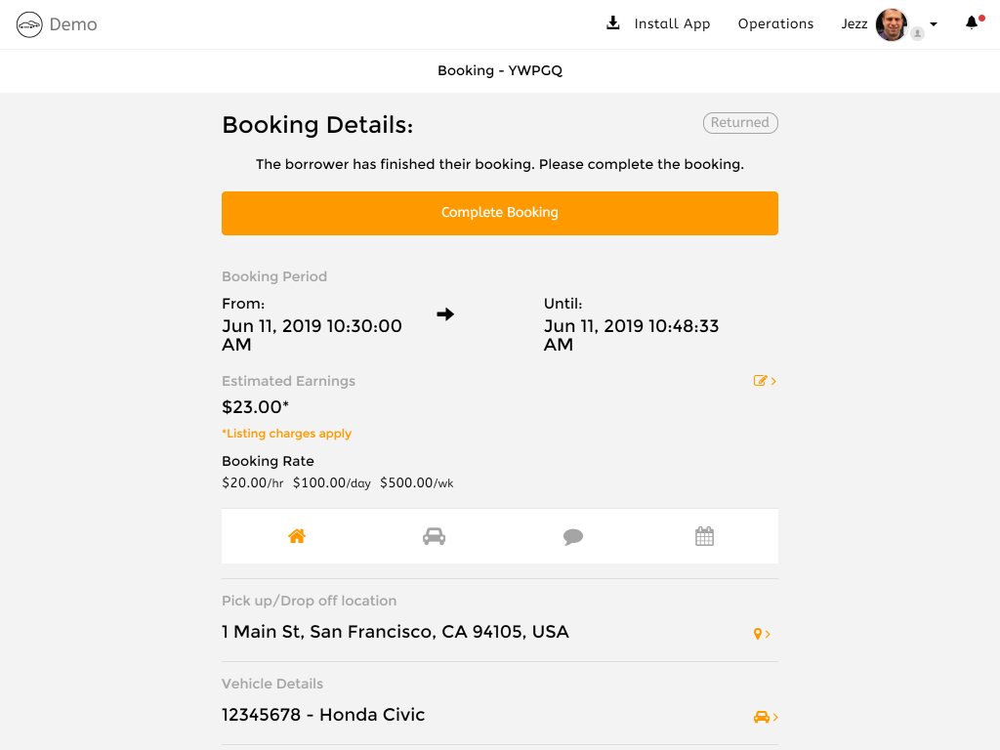

# Lets' try out your new Car Share

You've started your free 14 day free trial, you've created your new Car Share, and you've registered your new account.

**What do you do now?**

> We recognise that _right now_ it is not so easy to see what the experience looks like for your customers using Hourfleet once you have signed up. We are working on improving that with product videos and tutorials that are coming soon.

This is our first-steps tutorial, that is designed to walk you through the Hourfleet App. 

We will create some user accounts, register a new car and even rent out your car in the App.

After completing this, you should get a good feel for how Hourfleet works, and see some of the features that Hourfleet supports for you and your customers. 

It should give you a better understanding of how things hang together. There is a lot in Hourfleet, so we will try to keep it brief, and leave you to  explore the rest later.

If you are more interested in some of the concepts of how Hourfleet works, see our [How It Works](howitworks.html) page, but otherwise now it is time to get hands-on a see Hourfleet in action.

Here is the **plan** for this walkthrough:

1. You have already been invited to create your operators account in the App, but your customers will need their own accounts. So, we are going to create another account to represent one of your customers, who is going to borrow one of your cars.
2. Then we are going to register a car on your network. Don't worry, it does not have to be a _real_ car just yet. We are going to set it up for borrowing, and you can see some of the things that have to be in place for cars and their owners (you in this case).
3. Once your car is all set up, you are going to switch to acting as one of your customers, and go find and borrow your new car. You will then see how the booking system works and how the App helps guides your customers to finding and borrowing cars.
4. Finally, we are going to take the car offline, since, after this walk through you may or may not want others to book and use your fake car!

It may take you an hour to get through.

> Note: all the screenshots in this walkthrough are taken from an tablet sized mobile device (like an iPad). So what you see may be slightly different depending on whether you are on a windows or mac desktop, tablet or mobile phone device. You can do this walkthrough on any of those devices.

In any case, please use the **Google Chrome** browser to follow along with us in your own Car Share. We don't guarantee that other browsers are going to work properly.

OK, let's get started.

## Setting up accounts

By now, after creating your new Car Share, you should have already received an invitation by email to join your Car Share. Check your inbox.

If you have already been through the below process, **skip this next step**, you have already done it. just sign in to the App at your Car Share URL.

#### Creating your account

In that first email, there is a large 'Create Account' button, which if you click, sends you to the 'Create an Account' page below. 

Fill out your name, email and conviction status, declare yourself as not a robot, and create your account, and you will be signed in to your car sharing App.

### Your experience as an operator

>  Note: From here on out, now that you are seeing and using your Hourfleet App, we are just going to call it the 'App' for the rest of this walkthrough.

Now, things may look a bit funny in the App because you actually have a special account called an 'Operator' account. 

An operator account has a lot of special privileges that other users in your Car Share will not have. Such as looking at financial reports and managing all the cars and users in your Car Share network. 

The App experience is a little different since operators are not _as_ interested in borrowing their own cars as your customers are, so some of the tools they need are removed for you for simplicity.

In the top menu, click on the 'Operations' menu and you get to see some reports for your new Car Share. The data is a little bare at the moment, but it does change as things happen in your Car Share.

Your view of the App right now is quite different than a regular user of the App, but don't worry because all the things they see you can still get to in the side menu and the menu the footer of the App (just scroll down to see it). If you are on mobile device, the same stuff is there , but it is moved around a little to suit mobile device browsing.

OK, so now its time to see what a regular customer of your will experience when they use the App.

First, logout of the App, by clicking your name in the top right corner, and selecting 'Sign Out'. You will be returned to the 'Sign In' page.

## Create a new borrower account

Let's now create a new user account to represent a borrower on your network.

In the top right menu, select 'Join'. You will be presented with a page that asks for your email, and names. 

Here, you are going to make up a fictitious  name of a person, enter it in here (First Name, Last Name) and use this  specific email address: hourfleet@mailinator.com. 

Don't worry, this email address goes to a public email mailbox which everyone uses for this walkthrough. 

Click 'Join Now'.

**"You've got Mail!"**

An email gets whisked off to your fictitious person, inviting them to your Car Share.

Now lets go read that email in [this mailbox on the Mailinator.com website](https://www.mailinator.com/v3/index.jsp?zone=public&query=hourfleet#/#inboxpane). 

> Remember: this is a **public mailbox** that anyone can see, and you may even see emails in this mailbox from others following this walkthrough, but no problem. You are looking for an email that arrives from your Car Share to your fictitious person, that arrived 'Moments Ago'. It might take a minute or two, please be patient. There is no junk email folder here!

OK, open the email, and you will see a big button to click saying 'Create Account'. Click it.

Click 'Create Account'. 

You are brought back into your App at the 'Create Account' page, but this time you are your fictitious friend. 

Fill out the details, and click 'Create Now'.

Ok, now this time, your fictitious friend is going to need to fill out some details in their profile.

Leave the email address, and fill out the 'Mobile Number', Add the 'Drivers License'. You don't need to add the 'Credit Card' just yet. Don't panic.

For the 'Drivers License' just upload two pictures of anything you can for now. They could be of course pictures of cats, or trees, whatever you can get images of right now. Does not have to be a picture of an actual drivers license yet. (Not everyone has one these days anyway!) Fill out the rest with fake but reasonable information.

Then on the left menu, click the 'Profile' tab and add a profile avatar picture. It could be anything right now, your cat, your dog, a tree. Does not matter right now. But please do say a few words about your fictitious friend's 'Personal Description'. Try to keep this one reasonably real, because you are going to come across this person again in later in this walkthrough.

OK, once that is done, you are now your fictitious person, which is cool. But right now, you cannot do a lot except see cars on the map. Which right now has no cars!

In the top menu, click the profile image, and click 'Find a Car' 

You can see the map of all cars, which you can move around and search for cars. Nothing there yet.

Let's go create a car and put it on the map.

## Create a new car

Before you go off and create a new car, we need to swap users. 

You are currently signed in as your fictitious friend who will be borrowing a car owned by the real you. 

So first, you need to logout of this account and sign in as yourself, like you did at the start of this walkthrough.

When you sign in as yourself, you will be taken straight to the 'Operations Dashboard'. This is cool, because that where we are going to begin.

> Now, a word of explanation about car ownership: Even though you are an operator, you can also own cars on your network. In fact, technically most users can own cars. So, if you have another member of your staff in your business they can create an account and they can own a car too. A car must be owned by a user. So, for this walkthrough we are going to make you register the first car.

### List the new car

In the 'Operations Dashboard' page, on the left, click the 'Cars' menu.

Now click the 'List Vehicle' menu.

You will be brought to a page where you can click 'List Your Car'. 

Describe a fictional car, make and model, and click 'List your car now'

Once the car is created, you will be presented with some pages to configure the car.

Do the following in the following pages (click 'Save and Continue' at the bottom of each page):
* Carkit Compatibility - ignore this page for now.
* **General** - enter a 'Year', and change the 'Rental Model' to 'Auto-approve Requests' to ON.
* **Location** - enter the 'Home Address', it must be a real street address, in your city.
* **Pricing** - enter prices for 'Hourly', 'Daily', 'Weekly'
* **Photos** - upload at least one photo of the car. Try to use a photo of a real car, not a cat or your dog, this time.
* **Identity** - enter a license plate, road worthiness expiry date and number. You can make these up for now.

After you complete these details, the car should be display (green) ticks for all the categories on the left side.

Now, on the left menu, click 'Back to My Cars'

You will see your car listed there.

### Make the car available

We are not done just yet!

For a car to be available to be rented by anyone, it must have some future availability set for it by the car owner - that's you.

Under the picture of your car, click the 'Show Quick Actions' link, and select 'Availability'.

You now get presented with a calendar that shows the availability of your car in the future. Right now, it has no availability.

All we need to do here is add an available time slot for a couple of hours, beginning in 15mins time.

Use the 'Starting' and 'Ending' drop downs to create a time slot that starts in 15mins, and ends 3 hours later today. 

Then hit 'Add'. Don't worry if the time slot is longer. It is OK for now.

On the left menu, click 'Back to My Cars'

## Verify the borrower and the car owner

OK, so now we have a car, it is configured with a bunch of details, and the car has some future availability. 

However, it is still not enough for people to borrow the car just yet. Remember all those pictures of cats, dogs and fake information you may have put in earlier for your fictitious friend and your fake car?

Well, now its time to meet _Verifications_.

Verifications, are your way of managing your Car Share business, to ensure that the cars, and those borrowing them are all legitimate. After all, you don't really want to allow criminals nor fraudsters borrowing and damaging your cars and your business brand, right?

This is where **verifications** come in.

>  Everyone involved in borrowing a car, the car borrower, the car owner, as well as the car itself must all be legitimate. It's important that all parties that you manage have high trust for each other, and that your business remains compliant with important local and national guidelines for public vehicle usage.

> As the Car Share operator, its your responsibility to make sure that people and cars are legitimate, and that things are kept that way over time. For this reason, no car and no borrowers or car owners get anywhere near each other until they are fully verified, and stay that way. This is why the verifications exist, even though initially they are a little painful to setup, you will come to find they are necessary to protect your business in the future.

So, let's get started.

First we are going to verify the car owner and the fictitious  borrower friend of yours. Then we are going to verify your fake car.

On the top menu, click the 'Operations' menu. This brings you to the 'Operations Dashboard' again.

Now, click 'Users', click 'Verifications' and you should see your fictitious  friend and yourself listed there. Remember, you are the car owner right now.

Click on the name of your fictitious friend borrower (Jimmy Nimbus in this example), and you should see the verifications listed for the person.

Scroll up and down to all the verifications.

Right now, you should see that some of the verifications (such as: Terms of Service, Email and Conviction) are already verified (green), and some are not. 

As the operator, you get final call on what details are verified and which are not. 

To decide, you get presented with the raw information the person has provided, and you get to decide if it is legitimate or not.

> Note: Some verifications are managed automatically by Hourfleet. Such as credit cards, emails addresses etc. and do not require you to manually verify them. Others are very hard to verify electronically, and require a human to apply some diligence to them.

At the top is a special over-arching verification called 'Operator Verified' it rules them all. 

It is probably green right now, so don't worry about this one, focus on the blank ones further down the list.

You now get to see all the *sins* that people try to get away with when giving vital information about important credentials, such as drivers licenses etc. Do you see pictures and cats and dogs? or do you see legitimate drivers licenses, and accurate credentials?

For this walkthrough, we don't care so much about the legitimacy of this stuff right now. The idea was simply to show you the kinds of things that need to be managed with your customers.

For this person, who is going to borrow the car, you need to tick (green) the following verifications:
* Operator Verified
* Phone Number
* Email
* Criminal Conviction
* Drivers License
* Payment Method

Leaving only 'Bank Account' unticked.

>  Note: For a real person, you would be making sure these things are absolutely valid. And you may even decide to call the person on their mobile phone or write them in an email to ensure they are a real person! For now, it is OK, to let it slide.

When you are done ticking boxes and making the above verifications green for your fictitious  friend, then let's move on to your account.

On the left menu, click 'Verifications again, and click on your account. (The one you are signed in with right now!)

Lets do the same exercise, but this time, you only need to tick (green) the following verifications, as you are the car owner, not the borrower.
* Operator Verified
* Phone Number
* Email
* Criminal Conviction
* Bank Account

Leaving only 'Payment Method' and 'Driver's License unticked.

You can also see that you have been identified as being a car owner, and that you are 100% fully verified as a car owner.

By the way, when you start clicking your own verifications, you might start to see emails arriving in your inbox. Don't worry, that's intended. Hourfleet notifies people when their verifications status changes. It is important people get notified when their verifications change, because these things don't change that often, and when they do change, user's will want to know. Since it can stop them being able to use cars in your Car Share.

> Note: that all users can control exactly the notifications they get in the App. You can see that on your 'Notifications' page of your profile.

## Verify the car 

OK, we are done verifying the people, now lets verify the car.

On the left menu, click the icon of the car (to the far left!) 

Then, click 'Verifications'. You should see a list of all the cars you own. There should only be one right now.

Click on the car name, and this time you see a different list of verifications for a car.

For a car to be borrowed by anyone, it must be fully verified.

You have to tick (green) all these verifications:
* Operator Verified
* License Plate
* Registration (Can't change this!)
* Vehicle Worthiness

> Note: If you see that the 'Registration' verification is not ticked (green) right now, you missed a step when setting up the car. Perhaps a missing photo or license plate number? You need to go back and update the car. On the left, click the 'My Cars' menu, drop down the 'Show Quick Actions' menu, and click 'View All'. Then come back here after you have finished.

## Let's borrow the car!

Now that the car is fully verified, **and** the car owner (that's you) is fully verified, **and** the borrower is fully verified (your fictitious  friend), it is *finally* time to borrow the car.

Ooops! At this point, you need to swap accounts again. sorry!

You need to logout of your operator account, and sign in as your fictitious friend's account again.

When your fictitious friend signs in, they are taken directly to the 'Find a Car' page, where you should see your fictitious car on listed and placed on the map.

Let's not forget this car probably does not physically exist yet. (as in, it won't yet exist in the physical world). But that is OK for this walk through. We are going to assume for this walk through that you know where the car is located, and you have access to the car keys. (even if you don't and the car is not real!).

In Hourfleet, we call this rental model "Key Exchange" which means that you (the borrower) can obtain the real car keys from you (the car owner) at any time. Since, there is no physical ["carkit"](carkit.html) installed in the car, you have no choice than to use the physical car keys to open the car, and drive it away.

Alright, so how do you (the borrower) use the car?

When you registered the car, it was registered as being of the type of car that needs to be booked ahead of time. You also configured it to be 'Auto-Approved' and it has no "carkit" installed into it. Which makes the next bit all too easy.

In the 'Find a Car' page, click on the car in the list on the left. 

The map will center on the car pin, and show you a preview of the car.

OK, now. Click on the 'More Details' button. A popup will open up to show you more details about the car.

OK, now click on the 'Make a Request' button.

The form will expand to show you the current availability of the car. Which shows you when you can book the car.

You should see the availability you set for the car earlier. And hopefully, the time right now is within the time is available.

Now, select a time slot that starts in less than 15mins time, and goes for say an hour.

Hit the 'Book' button.

You are now moved to a confirmation page where you are asked to confirm the booking, and agree to the terms of service for this booking.

Since you are already verified (earlier), and since the car is configured to be automatically approved (and is also verified), your booking is going to go through automatically, and the car is yours to use!

Hit the 'Confirm Booking' button.

It takes a few seconds to approve the booking and then you are moved again to your 'Bookings' page. Where you should see your new booking, and its about to start soon.

> Also, as the car owner, you are going to get some email, to notify that someone has successfully booked your car!

OK, so now you have a confirmed booking that starts hopefully very soon. Perhaps minutes away.

Click on the 'Manage Booking' button and lets have a look at some of the information provided to you before your booking actually starts.

You can see when the booking will start, how much it will cost you and other important information.

- You can click the Edit icon to request a change to the booking times.
- You can click the Map icon to see the map of where the car is right now.
- You can click the Car icon to see details about the car, and report damage, capture pics of the car, etc.
- You can click the Chat icon to text and photo chat to the car owner.

In a few minutes (after the start time has passed) the booking will automatically start, and will start to track remaining time and cost to you the borrower.

In the real world, you would use the actual car keys, jump in the car, drive it around, do your business, and eventually return the car, and park it when you are done.

For this walkthrough, you just have to imagine doing all that virtually.

While using the car (obviously not while driving) you can use the App to do various things, like:

- Cancel the booking
- Finish the booking.
- You can also see all the information you need about the car and the booking.

Should you wish to live chat with the car owner about the condition of the car, you can do that too.

## Ending the booking

When you are done, click the far right control, and select 'Finish Booking'.

You will be asked to confirm whether you want to finish the booking. 

Confirm that now. You will be asked to rate and review your experience.

At this point, Hourfleet has recorded that you have returned your car within the allocated booking period, and gives you a summary of the booking. 

In the real world, you would only finish the booking after actually parking the car where you needed to park it. Also, as you may notice, the charge for this kind of booking is the whole period of the booking regardless of whether you finish the booking early or not.

> Note: If you forget to 'Finish Booking' and you walk away from the car, Hourfleet will complete the booking for you when the booking is due to finish, but it will also warn the car owner that you didn't record when you finished the booking. There are a set of configurable policies governing what happens when the car owner comes to look at the booking later, and it was not explicitly returned in the App.

Well, that is it for borrowing a car!

## Completing the booking

Finally, there is a follow-up step that the car owner would also need to perform in the App, that is expected to happen sometime after the borrower returns the car.

> Note: If the car owner does not perform this step, Hourfleet will perform this step automatically for them after 1 day (default). 

You can perform this step (as the car owner) by signing out as your fictitious friend and signing in as yourself again.

This time, click your profile, and select 'My Cars'

Under the picture of your car, click 'Show Quick Actions', and click 'Bookings'.

Here, you are going to see all the outstanding bookings for this car. 

Remember you are the car owner here, **and** the operator. This is the normal experience for any car owner.

On the left you see all the bookings for your cars that will need processing. 

Click on the 'Manage' link of the booking.

 You now see a view of the booking where you can 'Complete the Booking'.

Click the 'Complete the Booking' button.

The borrower returned the booking within the booking period, so you don't have to do anything there, all you have to do is make a statement about the returned condition of the car.

Hit 'Submit Choice', and then hit 'Complete Booking'.

You get a chance to rate and review the borrower's use of your car, and then you get a similar summary to the borrower.

> Notice: that your earnings (as a car owner) is zero in this case, because the operator of the Car Share (that's also you) gets all the profit of this rental! Which is the way Hourfleet is configured by default for a B2C Car Share. Revenue shares are also supported by Hourfleet, as are insurance fees, and late fees. But for this walkthrough those values are set to minimums. You can change these for your Car Share later.

You can now click the 'Back to my Bookings' link to get back to managing your bookings for this car.

Essentially, as a car owner you are now done.

## Wrap Up

OK, so now you have seen briefly what its like to setup and use a pre-booked "Key Exchange" car in Hourfleet from a customer's perspective, and from an operators perspective. 

You have seen what it takes to manage your Car Share users and its cars, as an operator, and what needs attention in your Car Share on a daily basis, as people register with your business and use your cars.

We haven't shown you everything here in Hourfleet. There is much, much more, and many more edge cases when real people use real cars, that you also need to learn about. But, hopefully you have seen enough to see the basics.

It is also worth saying that you have only seen the "Key Exchange" model of borrowing cars. There are other models that look and feel very different when a [Carkit](carkit.html) is fitted inside a car, that make the whole borrowing experience a lot smoother.

For now, we hope you have seen enough.

You can stay signed in as yourself and continue looking around, playing with cars and your users, and [customizing](configure.html) your Car Share to learn more about how Hourfleet can support your business.