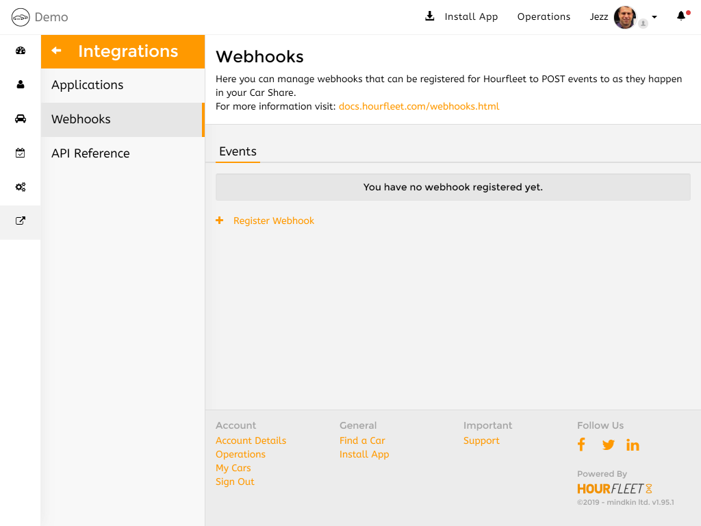
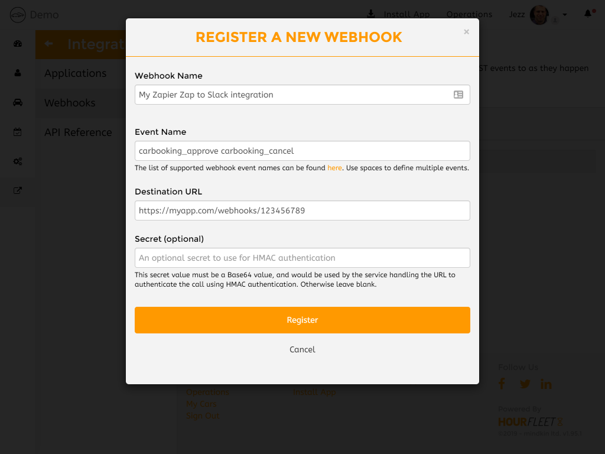

# Webhook Events

Hourfleet is built on a foundation of HTTP REST API's. This means that anything and everything that you and your customers can do in the Hourfleet App, can also be automated by any system on the internet by calling HTTP methods. See [API](api.html) for more details about those methods.

As well as calling the various API's that Hourfleet has, Hourfleet also provides a HTTP notification mechanism that raises events when they occur during normal operation of your Car Share. For example, a notification is raised when a new user joins your Car Share, telling you who just joined.

The mechanism by which this notification occurs is called 'Webhooks'. It's a simple publish/subscribe model that allows you to listen in on what's happening. In many cases, for the purposes of triggering some automated process or triggering some notification mechanism.  

## What notifications events are available?

The following table lists the available webhooks notifications that Hourfleet supports today.

| Resource      | Event Name          | Description                                |
| ------------- | ------------------- | ------------------------------------------ |
| UserAccounts  | useraccount_create  | A new user account was created             |
| Profiles      | profile_update      | A user's profile was updated               |
| Verifications | verification_update | A user's or car's verification was changed |
| Feedback      | feedback_update     | A user's or car's feedback was updated     |
|               | feedback_delete     | A user's or car's feedback was deleted     |
| Bookings      | carbooking_approve  | A booking for a car was approved           |
|               | carbooking_cancel   | The booking was cancelled                  |
|               | carbooking_use      | The booking was started (car was used)     |
|               | carbooking_extend   | The booking was extended longer or shorter |
|               | carbooking_return   | The booking was ended (car was returned)   |
|               | carbooking_complete | The booking was completed                  |

## How do they work?

Hourfleet publishes the above events at certain times during its operation.

If you are interested in these 'events'. You would first **subscribe** to these events by defining: 
1. the **event** you are interested in, and then 
2. the **URL** for Hourfleet to call when that event occurs.

This is known as a Webhook (catching an event with a hook, on the web).

Once you have registered your subscriber URL to a webhook, Hourfleet will then call your URL (**publish**) with information about the specific event you subscribed to. Webhooks can be added and removed at any time.

## How do you subscribe?

To subscribe to a webhook, you need to call your secure Hourfleet API to set up a webhook subscription. `POST https://yourcarshare.hourfleet.com:4431/api/webhooks/subscriptions`.

However, before you can do that, you will **need to know a URL** of some computer somewhere on the internet or in the cloud to receive that webhook notification (and do something useful with it). 

There are many of these URL endpoints (we call them) on the internet to receive these kinds of notifications. 

For example, some people have their own websites or web services that they can modify to receive these notifications. Some people have built their own cloud apps that can be added to to receive these notifications for them (i.e. Azure Functions, or Amazon Lambdas etc.).

For those not so technically savvy that require that level of functionality, there are services out there (like [Zapier.com](www.zapier.com) and [Automate.io](www.automate.io)) that can receive the notification from Hourfleet, and relay that notification to another app that you might already use (like: Slack, Intercom, or email inbox, etc.) effectively turning Hourfleet into another source of notifications that you already have in your business.

Either way, once you have a public URL to some site or service, you can register that URL as a subscriber to Hourfleet to receive a webhook notification.

OK, some inevitable technical details now. 

### What does a webhook notification look like?

Let's assume that you have setup a URL (using one of the methods noted above) to receive your webhook from Hourfleet, and your URL looks something like this: `https://myapp.com/webhooks/123456789`

AND you are interested in the Hourfleet event called: `carbooking_approve`

Then, once you subscribe with this URL, Hourfleet will send a notification to your URL. The notification would look something like this (over the web):

```
POST https://myapp.com/webhooks/123456789 HTTP/1.1
Accept: application/json
User-Agent: ServiceStack .NET Client 5.40
Accept-Encoding: gzip,deflate
X-Webhook-Delivery: 7a6224aad9c8400fb0a70b8a71262400
X-Webhook-Event: carbooking_approve
Content-Type: application/json
Host: myapp.com
Request-Id: |1f8d932d-4f0a0142f97a8306.
Content-Length: 26
Expect: 100-continue

{
    "Name":"carbooking_approve",
    "Id": "12345678-1234-1234-1234-1234-123456789012",
    "Reference": "ABCD1234",
    "CarId": "12345678-1234-1234-1234-1234-123456789012",
    "StartDateUtc": "2019-07-03T12:00:00.000Z",
    "EndDateUtc": "2019-07-04T06:00:00.000Z",
}
```

> Note: Hourfleet will always send you a HTTP **POST** request to your URL.

### Let's setup the webhook

Let's assume we are not technically savvy, and we have no websites or services of our own out there on the internet, and so we will want to use an integration provider to handle the technical stuff for us. 

We decide to create an account with [Zapier.com](www.zapier.com) and we want Zapier to relay the notification to one of our channels in our companies Slack workspace. 

(We are assuming that you use Slack for notifications in your business for this example). 

>  Note: You don't have to using Slack, you could just as easily use any email inbox or any of 100's of apps that you already have in your business for managing your communications - you can apply this process to any of those apps in roughly the same way as we detail below.

OK, so *conceptually*, this is what we will do (exact details omitted for brevity):

1. We will login to Zapier, and create a new Zap.
2. We will configure the Zap to receive a 'Webhook' *Trigger* from Hourfleet, and configure that webhook to send a notification *Action*  to one of our Slack channels.
3. We start by configuring the 'Webhook' to 'catch' a notification, and Zapier will generate a URL for you for your webhook.
4. We make a note of this URL. (lets say it looks like this: `https://myapp.com/webhooks/123456789`)
5. Next, in Zapier we will need to train the Zap with a sample of what kind of data it will get when being called. (data, like the example above). We will use a common tool like [PostMan]([https://www.getpostman.com](https://www.getpostman.com/)) (or other API tool like CURL) to send (POST) the request JSON above to the URL of our webhook in Zapier, to train the Zap.
6. Once the Zap receives the sample notification, it will decode the notification and learn about the various fields in the notification, which you might need for the next part.
7. Next, it is time to configure the Zap to forward the notification to a Slack channel.
8. We now connect to our Slack workspace, and select a channel to notify.
9. We configure the Zap to send a message to the channel with some content like 'Hi from Hourfleet' and we can also include any of the data in the notification that the Zap learned about.

> Note: You can see from the sample notification above that you can do a lot with the data in the notification. You might also decide to send an email, or create a link in the Hourfleet App with some pieces of that data too, or perhaps call another API in Hourfleet to get some other data about this event.

### Let's subscribe to an Hourfleet event

Now that we have Zapier setup to handle our webhook, all we now need to do is register our webhook in Hourfleet to trigger the Zapier Zap.

Login to your Hourfleet app at: https://yourcarshare.hourfleet.com. 

Go to the 'Operations' dashboard, and in the left menu select "Integrations". Select "Webhooks".

Now, register a new Webhook. 



Give it a name of your choice, and use `https://myapp.com/webhooks/123456789` (that we got from our Zap) for the 'Destination URL' and `carbooking_approve` for the 'Event Name' (from the table above). 


Click on 'Register' to finish.

Your webhook is now all setup and ready to be fired by Hourfleet.

To try it out, make a booking for a car and see the even in your Slack channel.