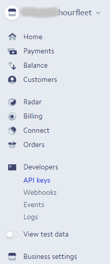

# What You Need to Provide

Setting up a new car sharing business can be complicated. There is quite a bit to think about besides having a web site, an app and some cars.

You are also going to need to run a legitimate company in your country and jurisdiction, and worry about things like: Insurance, Terms Of Service, Privacy Policies, Tier1 Support, Marketing, Social Media, etc.

One of the things you are going to get with Hourfleet (see [What Is In The Box](inthebox.html)) is your own cloud 'tenancy' on the Hourfleet platform with your own branded app for your customers, with other tools for managing your car sharing business. While the Hourfleet platform provides many of the online tools to help manage your customers and operate your car sharing, you are still going to need to sort out a few commericial relationships with supporting businesses so that the platform automate most of the work for you.

These are broadly some of the things that you need to do:

* Create an account with Stripe.com, so that you can charge your customers' credit cards
* Construct a Terms Of Service agreement with your Lawyers
* Create a Privacy Policy with your Lawyers
* Create a 'landing page' website to inform and capture your customers, and that can lead your customers to register and use cars in your network.

# Stripe Account
If you don't alread have a Stripe account you'll need to [register](https://dashboard.stripe.com/register). 

> If you need to do this, we recommend you take some time [to learn about Stripe](https://stripe.com/customers). 

The next step is to configure your Hourfleet tenancy with your Stripe API keys. This enables your Hourfleet tenancy to bill your customers when they use your car sharing service.

>  Without this, you cannot bill your customers

## Setting Up Hourfleet

From your Stripe Dashboard, click `Developers` and then `API Keys`. 

On the right you'll then see a panel which contains two API keys  

Make a note of the `Publishable key`. 
Then click `Reveal live key token` and the `Secret key` will be displayed. 

> It's secret for a reason - don't leave this lying around!

Send both keys in an email to `admin@mindkin.co.nz` and then delete any reference to these keys from your computer. 

> Remember to check your email's Sent Items and Trash too.

Once we receive these keys we will configure your tenancy, and the Stripe setup will be complete.

**Important**: Your relationship with Stripe is governed by your acceptance of their Terms of Service. We are unable to manage any aspect of your relationship with Stripe, or to advocate for you. Other than initiating charges to your cstomers as covered by our Terms of Service, we are unable to act for or on your behalf.
