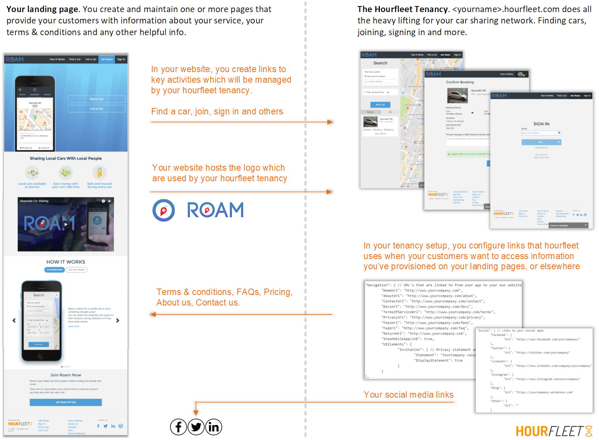

# Website Integration

Hourfleet is a fully featured car sharing platform and the Hourfleet App will help your customers register their accounts, register their cars, and book and use the cars on your Car Sharing network. It has all the tools they need, and all the tools you need to operate your car sharing business.

However, there is still a set of information your customers will need before they feel comfortable using your car sharing service.

This information includes things like:

* A Terms of Service - specific to your car sharing business and proposition
* A Privacy Policy - explaining what information you will collect from your customers and how you will use it
* How It Works - Additional information you want your customers to see to understand your specific car sharing proposition
* Insurance Details - How your insurance works, and how your customers make claims in case bad stuff happens.

From experience with lots of other car sharing businesses, we have learned that your customers' experience with you is best served by you providing this information from your own website in a form that reflects your proposition. Then the Hourfleet App is best at making that information available to your customers where they need it, when they need it.

For this reason, you will need to host these pages of information on your own website, and then you would configure your car share App to share that information with your customers when they need it.

> Note: The Hourfleet App does provide a built-in Support page (found at: `https://yourcarshare.hourfleet.com/support`) that is constructed from some of the information that you provide in customizing your car Share, that we share with your customers in those desperate moments they might need quick support. However, this experience is a very limited one for that specific purpose. Furthermore, you can also choose to provide your own support page instead of that too in [Configure Support](configure-support.html).

# How it works

As they say, a picture is worth a thousand words ... this is how it works between the Hourfleet App and the pages on your website:

  
